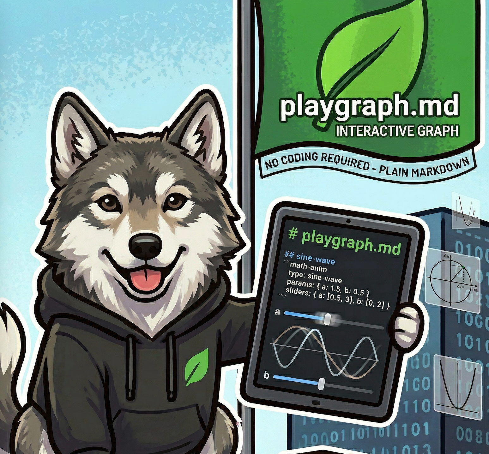
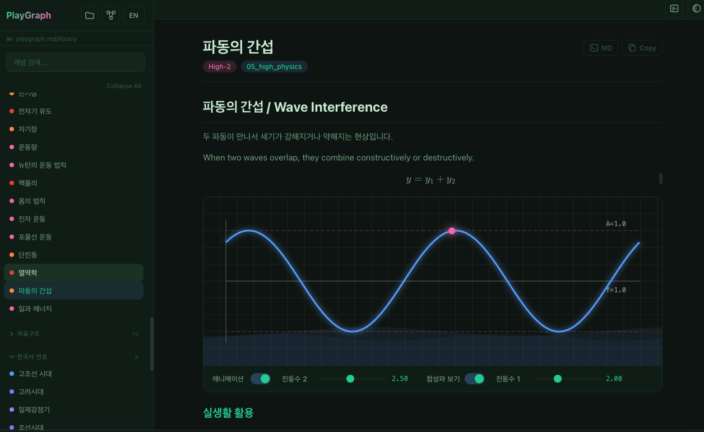
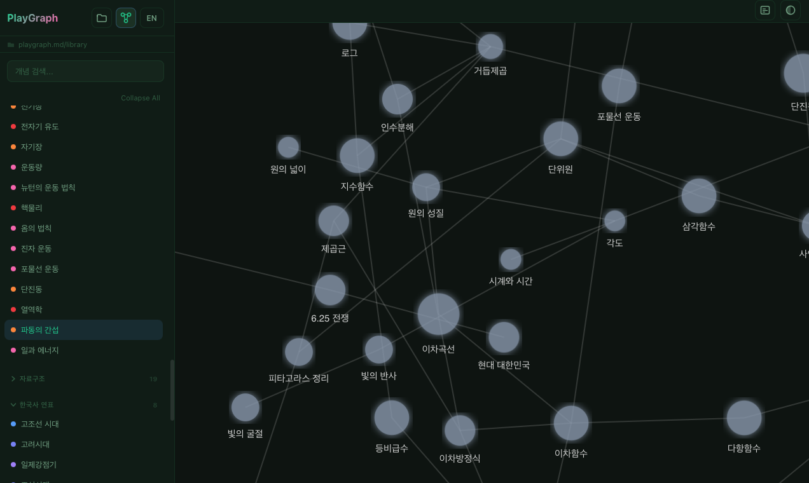

<p align="center">
  
</p>

# playgraph.md

[](LICENSE)
[](https://www.rust-lang.org/)
[](https://tauri.app/)
[](https://react.dev/)
[](https://github.com/leaf-kit/playgraph.md/stargazers)

**Markdown-powered Interactive Animation Viewer** — Explore concepts across math, physics, data structures, history, software engineering and more through visual animations and knowledge graphs.

> **v0.2.0 "Warm Classroom"** — [GitHub Release](https://github.com/leaf-kit/playgraph.md/releases/tag/v0.2.0) | [Homebrew Tap](https://github.com/leaf-kit/homebrew-playgraph) | [CHANGELOG](CHANGELOG.md)
>
> ```bash
> brew tap leaf-kit/playgraph.md && brew install playgraph
> ```

---

## Screenshots

**Animation View — Wave Interference**



**Knowledge Graph View**



---

## Terminology

| Term | Description |
|------|-------------|
| **Concept** | A single topic (e.g., "Sine Wave", "Newton's Laws") represented as a markdown file with YAML frontmatter and `math-anim` blocks |
| **Library** | Collection of concept markdown files organized by category (math, physics, data structures, history, software engineering, etc.) |
| **Knowledge Graph** | Interactive force-directed graph visualization showing connections between concepts |
| **math-anim block** | Fenced code block (` ```math-anim `) inside markdown that defines an interactive animation with configurable parameters |
| **Fly-to Navigation** | Smooth zoom transition from the knowledge graph to a specific concept viewer |

---

## Why playgraph.md?

### The Problem

Educational content is too static. Textbooks show frozen graphs, formulas, and diagrams. Students struggle to build intuition because they can't *play* with the parameters and *see* how things change in real time.

### The Solution

**playgraph.md** reads markdown files containing `math-anim` blocks and renders them as fully interactive animations. Beyond math, you can visually explore concepts in physics, data structures, history, software engineering, and more. Drag a slider and watch a wave reshape. Rotate the unit circle and see sin/cos projections update live. Every animation is defined in plain markdown — no coding required.

---

## Features

| Category | Feature |
|----------|---------|
| **Interactive Animations** | Real-time Canvas 2D animations driven by slider parameters |
| **Knowledge Graph** | Force-directed graph connecting 130+ concepts across disciplines with fly-to navigation |
| **Markdown-Powered** | Concepts are plain `.md` files with YAML frontmatter and `math-anim` blocks |
| **Hot Reload** | Edit a markdown file externally and the app reflects changes instantly |
| **i18n** | Korean and English toggle for all concept titles and UI |
| **KaTeX Rendering** | Beautiful LaTeX math formulas rendered inline and in display mode |
| **Zoom & Pan** | Infinite canvas with smooth zoom/pan on both animations and the knowledge graph |
| **Dark Theme** | Elegant dark UI designed for focus and visual clarity |
| **Tauri v2** | Fast, lightweight desktop app with Rust backend and React frontend |

---

## Installation

### Homebrew (macOS / Linux)

```bash
brew tap leaf-kit/playgraph.md
brew install playgraph
```

### From Source

```bash
git clone https://github.com/leaf-kit/playgraph.md.git
cd playgraph.md
npm install
cd src-tauri && cargo test && cd ..
cargo tauri build
```

Or use the build script:

```bash
./build.sh
# Select option 2 for release build
```

### Prerequisites

- [Rust](https://www.rust-lang.org/tools/install) 1.77+
- [Node.js](https://nodejs.org/) 18+
- [Tauri CLI](https://tauri.app/start/) (`cargo install tauri-cli`)

---

## Usage

### Running in Development

```bash
cargo tauri dev
```

### Library Structure

Concept files are organized under `library/`:

```
library/
├── 01_elementary_math/      # Elementary Math
├── 02_middle_math/          # Middle School Math
├── 03_middle_physics/       # Middle School Physics
├── 04_high_math/            # High School Math
├── 05_high_physics/         # High School Physics
├── 06_data_structures/      # Data Structures & Algorithms
├── 07_korean_history/       # Korean History
└── 08_software_engineering/ # Software Engineering
```

### Writing a Concept File

Each concept is a markdown file with YAML frontmatter:

```markdown
---
id: "sine-wave"
title: { kr: "사인 함수", en: "Sine Wave" }
difficulty: "Middle-3"
connections: ["unit-circle", "oscillation"]
---

# Sine Wave

$$y = A \sin(Bx + C) + D$$

` `` math-anim
type: sine-wave
params:
  amplitude: { default: 1, min: 0.1, max: 3, step: 0.1, label: { kr: "진폭", en: "Amplitude" } }
  frequency: { default: 1, min: 0.1, max: 5, step: 0.1, label: { kr: "주파수", en: "Frequency" } }
` ``
```

---

## Playground

The `playground/` directory contains test resources for verifying the app:

```
playground/
└── (test markdown files and resources)
```

### Sample Concepts (v0.1.0)

| Concept | Category | Difficulty | Animation |
|---------|----------|------------|-----------|
| Sine Wave | Functions | Middle-3 | Interactive wave with amplitude/frequency/phase sliders + wave effect |
| Pythagorean Theorem | Geometry | Middle-2 | Animated right triangle with area squares visualization |
| Unit Circle | Functions | High-1 | Rotating point with sin/cos projections + sine trace |

---

## Build Script

```bash
./build.sh
```

```
==================================
  playgraph v0.2.0 — Build & Dev
==================================

  1) Build (debug)
  2) Build (release)
  3) Run tests
  4) Run clippy (lint)
  5) Clean build artifacts
  6) Dev mode (live reload)
  7) Create release tarball
  8) Deploy to Homebrew
  0) Exit
```

Tests are required before release builds (option 2). The script automatically runs `cargo test` and `cargo clippy` before building.

---

## Update

| Method | Command |
|--------|---------|
| Homebrew | `brew upgrade playgraph` |
| Source | `git pull && ./build.sh` |

## Uninstall

| Method | Command |
|--------|---------|
| Homebrew | `brew uninstall playgraph && brew untap leaf-kit/playgraph.md` |

---

## Tech Stack

| Layer | Technology |
|-------|-----------|
| Desktop Framework | [Tauri v2](https://tauri.app/) |
| Backend | Rust (serde, pulldown-cmark, notify, walkdir) |
| Frontend | React 19 + TypeScript + Vite |
| Animations | HTML5 Canvas 2D API |
| Knowledge Graph | d3-force + d3-zoom (SVG) |
| Math Rendering | [KaTeX](https://katex.org/) |

---

## Roadmap

- [x] Core viewer with 3 sample animations
- [x] Knowledge graph with fly-to navigation
- [x] i18n (KR/EN)
- [x] Hot-reload file watcher
- [x] Expand concept library (8 categories, 126 concepts)
- [x] Grade-level adaptive explanations (Elementary/Middle/High)
- [ ] Search with fuzzy matching
- [ ] Animation export (GIF/video)
- [ ] Plugin system for custom animations
- [ ] Mobile support

---

## Changelog

See [CHANGELOG.md](CHANGELOG.md) for detailed release notes.

---

## Feedback & Contributing

Issues and PRs are welcome on [GitHub](https://github.com/leaf-kit/playgraph.md/issues).

---

## License

[MIT](LICENSE)
