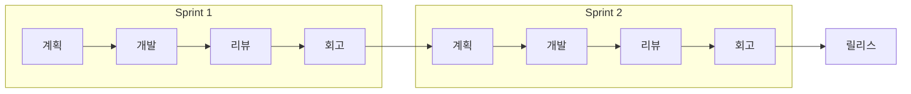

# 애자일 방법론 / Agile Methodology

반복적이고 점진적인 개발을 통해 빠르게 가치를 전달하고, 변화에 유연하게 대응하는 개발 방법론입니다.

An iterative and incremental approach to software development that delivers value quickly and adapts to change.



## 핵심 가치 (애자일 선언문)

- 프로세스와 도구보다 **개인과 상호작용**
- 포괄적인 문서보다 **작동하는 소프트웨어**
- 계약 협상보다 **고객과의 협력**
- 계획을 따르기보다 **변화에 대응**

```math-anim
type: agile-methodology
params:
  sprintLength: { default: 2, min: 1, max: 4, step: 1, label: { kr: "스프린트 주기 (주)", en: "Sprint Length (weeks)" } }
  velocity: { default: 20, min: 5, max: 50, step: 5, label: { kr: "팀 속도 (포인트)", en: "Velocity (points)" } }
  showBurndown: { default: true, label: { kr: "번다운 차트", en: "Burndown Chart" } }
```

## 실생활 활용

- **스타트업 제품 개발**
- **웹/모바일 앱 개발**
- **지속적인 사용자 피드백이 필요한 프로젝트**
