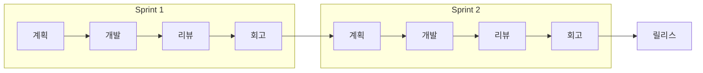

# 애자일 방법론 / Agile Methodology

반복적이고 점진적인 개발을 통해 빠르게 가치를 전달하고, 변화에 유연하게 대응하는 개발 방법론입니다.

An iterative and incremental approach to software development that delivers value quickly and adapts to change.

## 🌟 선생님의 다정한 설명

### 🎈 초등학생 눈높이

여러분, 레고로 로봇을 만든다고 생각해 봐요. 두 가지 방법이 있어요:

**방법 1 (폭포수):** 설계도를 완벽하게 그리고 → 모든 부품을 한꺼번에 조립 → 완성!
**방법 2 (애자일):** 먼저 다리만 만들어 보고 → "괜찮네!" → 몸통 추가 → "더 좋아!" → 팔 추가 → 완성!

애자일은 **방법 2**처럼 조금씩 만들면서 계속 확인하는 거예요!

요리에 비유하면, 국을 끓일 때 간을 한 번에 다 맞추는 게 아니라 **조금씩 넣으면서 맛을 보는 것**과 같아요. "좀 싱겁네?" → 소금 추가 → "지금은 어때?" → "딱 좋아!" 이렇게요.

매번 **"이만큼 했는데 어때?"**라고 물어보고 피드백을 받는 것이 애자일의 핵심이랍니다!

### 📐 중학생 눈높이

여러분이 친구들과 함께 **학교 앱**을 만든다고 해 봐요. 애자일 방식으로는 이렇게 진행해요:

**1주차 (Sprint 1):** 로그인 기능만 만들기 → 친구들에게 보여주기 → "비밀번호 찾기도 넣어줘!"
**2주차 (Sprint 2):** 시간표 보기 기능 추가 → 보여주기 → "색깔이 더 예뻤으면..."
**3주차 (Sprint 3):** 급식 메뉴 기능 추가 + 디자인 개선

이런 식으로 **2~4주 단위(스프린트)**로 작은 기능을 완성하고, 매번 사용자 피드백을 받아요. 게임으로 치면 **얼리 액세스**와 비슷해요! 완성되기 전에 유저들이 플레이하면서 의견을 주고, 개발자가 반영하는 거죠.

### 🎓 고등학생 눈높이

2001년, 17명의 소프트웨어 개발자들이 미국 유타주 스키 리조트에 모여 **애자일 선언문(Agile Manifesto)**을 작성했어요. 이것이 현대 소프트웨어 개발의 판도를 바꿨죠.

현업에서의 애자일:
- **스크럼(Scrum):** 가장 많이 사용되는 애자일 프레임워크. 스프린트, 데일리 스탠드업, 스프린트 리뷰 등의 이벤트로 구성돼요
- **칸반(Kanban):** 작업을 시각화하고 WIP(Work In Progress)를 제한하는 방법
- **스프린트 플래닝, 데일리 스크럼, 스프린트 리뷰, 회고** — 이 4가지 미팅이 스크럼의 핵심 이벤트예요
- 구글, 마이크로소프트, 스포티파이 등 대부분의 IT 기업이 애자일을 채택하고 있어요
- **스크럼 마스터**, **프로덕트 오너** 같은 애자일 전문 직군도 있답니다

## 🔍 어떻게 작동하는지 알아볼까요?

애자일의 작동 방식을 스프린트 단위로 살펴볼게요:

**스프린트 시작 전: 백로그(Backlog) 정리**
- 만들어야 할 기능 목록을 우선순위대로 정리해요
- "사용자 스토리"라는 형태로 "~한 사용자로서, ~하고 싶다"를 작성해요

**스프린트 계획 (Sprint Planning)**
- 이번 스프린트에서 어떤 작업을 할지 팀이 함께 결정해요
- 각 작업의 크기를 추정하고 (보통 스토리 포인트 사용), 팀의 역량에 맞게 선택해요

**스프린트 진행 (2~4주)**
- 매일 아침 15분간 **데일리 스탠드업** 미팅을 해요: "어제 한 일 / 오늘 할 일 / 막히는 점"
- 칸반 보드로 작업 상태를 시각화해요: To Do → In Progress → Done

**스프린트 리뷰 (Sprint Review)**
- 완성된 기능을 이해관계자에게 시연해요
- "이번에 이만큼 만들었어요! 어떠세요?" → 피드백 수집

**스프린트 회고 (Retrospective)**
- 팀끼리 모여서 되돌아봐요: "잘한 점, 개선할 점, 다음에 시도할 점"
- 프로세스 자체를 계속 개선하는 것이 애자일의 진정한 힘이에요!

이 사이클이 **반복**되면서 소프트웨어가 점점 완성되어 가요.



## 핵심 가치 (애자일 선언문)

- 프로세스와 도구보다 **개인과 상호작용**
- 포괄적인 문서보다 **작동하는 소프트웨어**
- 계약 협상보다 **고객과의 협력**
- 계획을 따르기보다 **변화에 대응**

```math-anim
type: agile-methodology
params:
  sprintLength: { default: 2, min: 1, max: 4, step: 1, label: { kr: "스프린트 주기 (주)", en: "Sprint Length (weeks)" } }
  velocity: { default: 20, min: 5, max: 50, step: 5, label: { kr: "팀 속도 (포인트)", en: "Velocity (points)" } }
  showBurndown: { default: true, label: { kr: "번다운 차트", en: "Burndown Chart" } }
```

### 🌟 선생님의 관찰 노트

- **관찰 내용:** 다이어그램에서 Sprint 1과 Sprint 2가 같은 구조(계획→개발→리뷰→회고)를 반복하는 것이 보이나요? 번다운 차트를 켜면 스프린트 동안 남은 작업량이 점점 줄어드는 모습도 관찰할 수 있어요.
- **관찰 결과:** 애자일의 핵심은 **반복과 피드백**이에요. 같은 구조를 반복하지만 매번 새로운 가치를 전달하고, 회고를 통해 프로세스 자체도 개선돼요. 속도(Velocity) 슬라이더를 조절하면 팀의 생산성에 따라 스프린트에서 처리할 수 있는 작업량이 달라지는 것도 볼 수 있답니다.
- **연결 질문:** "스프린트 길이가 1주일 때와 4주일 때, 각각 어떤 장단점이 있을까요? 여러분이 팀 리더라면 몇 주 스프린트를 선택하겠어요?"

## 🔗 개념 연결 고리

- ➡️ **SDLC** (sdlc): 애자일은 SDLC를 반복적으로 수행하는 현대적 방법론이에요
- ↔️ **폭포수 모델** (waterfall-model): 순차적 접근 vs 반복적 접근, 서로 비교하면 이해가 깊어져요
- ➡️ **CI/CD 파이프라인** (cicd-pipeline): 애자일의 빠른 배포 주기를 기술적으로 지원해요
- ➡️ **Git 워크플로우** (git-workflow): 스프린트별 브랜치 전략이 애자일과 함께 사용돼요

## 실생활 활용

- **스타트업 제품 개발** - 스타트업은 시장 반응을 빠르게 확인해야 하기 때문에, 2주 스프린트로 MVP를 빠르게 출시하고 피벗(방향 전환)할지 결정해요. 배달의민족, 토스도 애자일로 시작했답니다!
- **웹/모바일 앱 개발** - 앱스토어 업데이트를 2~4주마다 하는 이유가 바로 애자일 스프린트 주기와 맞물려 있어요. 사용자 리뷰를 다음 스프린트에 반영하죠.
- **지속적인 사용자 피드백이 필요한 프로젝트** - 교육 플랫폼, SNS, 커머스 등 사용자 경험이 핵심인 서비스는 애자일이 필수예요. A/B 테스트와 함께 사용하면 효과가 배가 됩니다.
- **게임 개발** - 인디 게임 스튜디오에서 스팀 얼리 액세스로 출시하고, 플레이어 피드백을 반영하며 업데이트하는 것이 전형적인 애자일 방식이에요.
- **학교 팀 프로젝트** - 매주 진행 상황을 공유하고 피드백을 주고받는 것도 애자일의 일종이에요!
