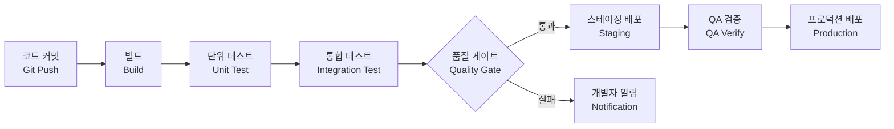

# CI/CD 파이프라인 / CI/CD Pipeline

코드 변경을 자동으로 빌드, 테스트, 배포하는 지속적 통합/지속적 배포 프로세스입니다.

Continuous Integration and Continuous Deployment — automating the build, test, and deployment process.

## 🌟 선생님의 다정한 설명

### 🎈 초등학생 눈높이

여러분, **자동 세차기**를 본 적 있나요? 차를 넣으면 자동으로 물 뿌리기 → 비누칠 → 문지르기 → 헹구기 → 말리기가 차례대로 진행되잖아요! CI/CD도 이것과 같아요!

개발자가 코드를 작성해서 "완성!" 버튼을 누르면:
1. 🔨 **자동으로 조립해요** (빌드) - 레고 블록이 자동으로 합쳐지는 것처럼
2. ✅ **자동으로 검사해요** (테스트) - 잘 만들어졌는지 로봇이 확인
3. 📦 **자동으로 포장해요** (배포 준비) - 예쁘게 상자에 담기
4. 🚀 **자동으로 배달해요** (배포) - 사용자에게 전달!

사람이 일일이 하지 않아도 **기계가 알아서** 해주는 거예요. 마치 공장의 컨베이어 벨트처럼요!

### 📐 중학생 눈높이

여러분이 만든 앱을 친구들에게 배포한다고 생각해 봐요. 매번 이렇게 해야 해요:
- 코드 컴파일 → 테스트 실행 → APK/IPA 파일 만들기 → 서버에 올리기

이걸 **매일 10번** 해야 한다면? 너무 귀찮고 실수할 수 있겠죠?

CI/CD 파이프라인은 이 모든 과정을 **자동화**해요:
- **CI (지속적 통합):** 코드를 Push할 때마다 자동으로 빌드하고 테스트를 돌려요. 마치 게임에서 자동 저장되는 것처럼!
- **CD (지속적 배포):** 테스트를 통과하면 자동으로 서버에 배포해요. 마치 유튜브 영상을 예약 업로드하는 것처럼!

GitHub Actions를 사용하면 `.yml` 파일 하나로 이 모든 것을 설정할 수 있어요.

### 🎓 고등학생 눈높이

CI/CD는 **DevOps 문화**의 핵심 기술이에요:

- **Netflix**는 하루에 수천 번 배포해요. CI/CD 없이는 불가능하죠
- **GitHub Actions, Jenkins, GitLab CI, CircleCI** 등이 대표적인 CI/CD 도구예요
- **DevOps 엔지니어**라는 직군이 CI/CD 파이프라인을 구축하고 관리해요
- **Infrastructure as Code (IaC):** Terraform, Ansible 등으로 인프라도 코드로 관리해요
- CI/CD 파이프라인 구축 경험은 백엔드, 풀스택 개발자 채용에서 큰 가산점이에요
- **컨테이너 기술(Docker, Kubernetes)**과 결합하면 더욱 강력한 배포 자동화가 가능해요

## 🔍 어떻게 작동하는지 알아볼까요?

CI/CD 파이프라인의 전체 흐름을 단계별로 살펴볼게요:

**1단계: 코드 커밋 & Push**
- 개발자가 코드를 수정하고 Git에 Push해요
- 이 순간 파이프라인이 자동으로 시작돼요!

**2단계: 빌드 (Build)**
- 소스 코드를 실행 가능한 형태로 컴파일해요
- 의존성 라이브러리도 자동으로 다운로드 받아요

**3단계: 단위 테스트 (Unit Test)**
- 각 함수와 모듈이 올바르게 동작하는지 자동으로 검사해요
- 하나라도 실패하면 개발자에게 알림이 가요

**4단계: 통합 테스트 (Integration Test)**
- 여러 모듈이 함께 잘 동작하는지 확인해요
- 데이터베이스 연동, API 호출 등을 테스트해요

**5단계: 품질 게이트 (Quality Gate)**
- 코드 커버리지, 코드 스멜, 보안 취약점 등을 검사해요
- 기준을 통과하지 못하면 배포가 중단돼요

**6단계: 스테이징 배포 (Staging)**
- 프로덕션과 동일한 환경에서 최종 테스트해요
- QA 팀이 수동으로 검증하기도 해요

**7단계: 프로덕션 배포 (Production)**
- 모든 검증을 통과하면 실제 사용자에게 배포돼요
- 블루/그린 배포, 카나리 배포 등의 전략을 사용해요

## CI vs CD

| 구분 | CI (지속적 통합) | CD (지속적 배포) |
|------|-----------------|-----------------|
| 범위 | 빌드 + 테스트 자동화 | 배포까지 자동화 |
| 주기 | 커밋마다 | 릴리스마다 |
| 도구 | Jenkins, GitHub Actions | ArgoCD, Spinnaker |

### 🌟 선생님의 관찰 노트

- **관찰 내용:** 다이어그램에서 코드 커밋부터 프로덕션 배포까지 일직선으로 연결된 파이프라인이 보이나요? 중간에 품질 게이트가 있어서, 통과하면 스테이징으로 가고 실패하면 개발자에게 알림이 가는 분기점도 확인할 수 있어요.
- **관찰 결과:** CI/CD 파이프라인은 **자동화된 품질 관문**이에요. 사람이 매번 수동으로 검사하는 것보다 훨씬 빠르고 정확하죠. 특히 품질 게이트가 "통과/실패"로 분기되는 부분이 중요해요 — 나쁜 코드가 사용자에게 전달되는 것을 막아주는 **안전장치** 역할을 하니까요.
- **연결 질문:** "만약 CI/CD 파이프라인 없이 개발자가 직접 서버에 배포한다면 어떤 위험이 있을까요? 자동화가 오히려 문제를 일으킬 수 있는 경우는 없을까요?"

## 🔗 개념 연결 고리

- ➡️ **Git 워크플로우** (git-workflow): Git Push가 CI/CD 파이프라인의 시작점이에요
- ➡️ **테스트 전략** (testing-strategy): 파이프라인에서 어떤 테스트를 어떤 순서로 실행할지 결정해요
- ➡️ **마이크로서비스 아키텍처** (microservices-architecture): 서비스별 독립 배포가 CI/CD로 가능해져요
- ➡️ **SDLC** (sdlc): CI/CD는 SDLC의 빌드-테스트-배포 단계를 자동화한 것이에요

## 실생활 활용

- **GitHub Actions / GitLab CI** - 가장 널리 사용되는 CI/CD 도구예요. `.github/workflows/` 폴더에 YAML 파일을 작성하면 Push할 때마다 자동으로 빌드, 테스트, 배포가 실행돼요. 무료 플랜도 충분히 강력해요!
- **Docker + Kubernetes 배포** - Docker로 애플리케이션을 컨테이너화하고, Kubernetes로 오케스트레이션하면 CI/CD 파이프라인에서 일관된 환경으로 배포할 수 있어요.
- **마이크로서비스 운영** - 각 서비스마다 독립적인 CI/CD 파이프라인을 구축하면, 서비스별로 독립 배포가 가능해져요. Netflix, Amazon이 이런 방식을 사용해요.
- **모바일 앱 배포** - Fastlane + CI/CD로 iOS/Android 앱을 자동으로 빌드하고 앱스토어에 제출할 수 있어요.
- **정적 웹사이트 배포** - Vercel, Netlify 같은 플랫폼은 Git Push만으로 자동 배포되는 CI/CD를 내장하고 있어요!
