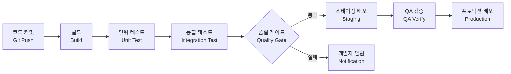

# CI/CD 파이프라인 / CI/CD Pipeline

코드 변경을 자동으로 빌드, 테스트, 배포하는 지속적 통합/지속적 배포 프로세스입니다.

Continuous Integration and Continuous Deployment — automating the build, test, and deployment process.

## CI vs CD

| 구분 | CI (지속적 통합) | CD (지속적 배포) |
|------|-----------------|-----------------|
| 범위 | 빌드 + 테스트 자동화 | 배포까지 자동화 |
| 주기 | 커밋마다 | 릴리스마다 |
| 도구 | Jenkins, GitHub Actions | ArgoCD, Spinnaker |

## 실생활 활용

- **GitHub Actions / GitLab CI**
- **Docker + Kubernetes 배포**
- **마이크로서비스 운영**
