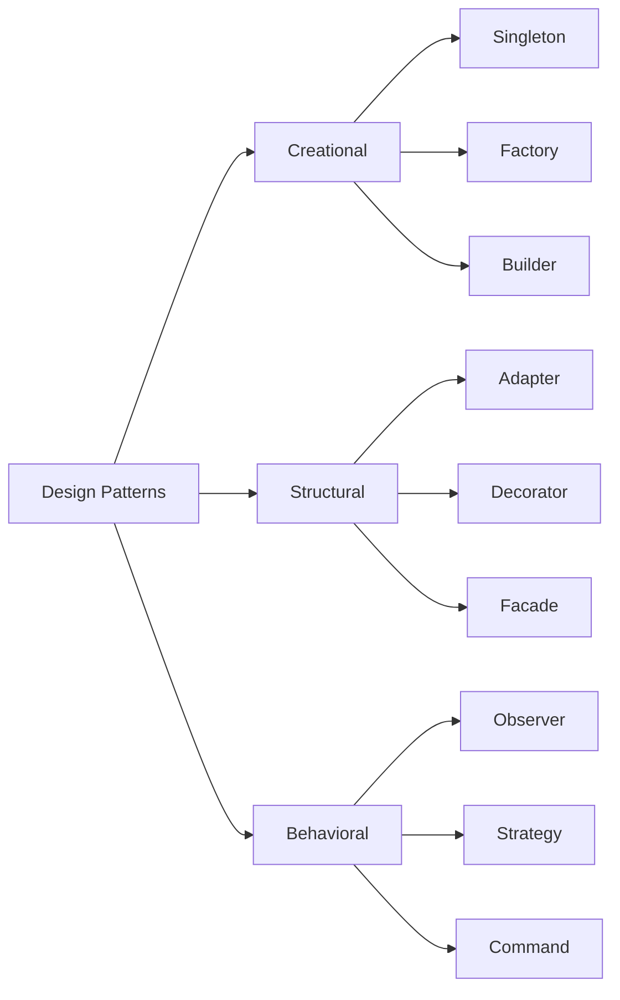

# 디자인 패턴 / Design Patterns

반복적으로 발생하는 소프트웨어 설계 문제에 대한 재사용 가능한 해결책입니다.

Reusable solutions to commonly occurring problems in software design.

## GoF 23가지 패턴 분류

| 분류 | 패턴 예시 | 목적 |
|------|-----------|------|
| 생성 | Singleton, Factory, Builder | 객체 생성 방식 제어 |
| 구조 | Adapter, Decorator, Facade | 클래스 조합 구조화 |
| 행위 | Observer, Strategy, Command | 객체 간 책임 분배 |

## 실생활 활용

- **프레임워크 아키텍처 설계**
- **확장 가능한 코드 작성**
- **코드 리뷰 기준**
