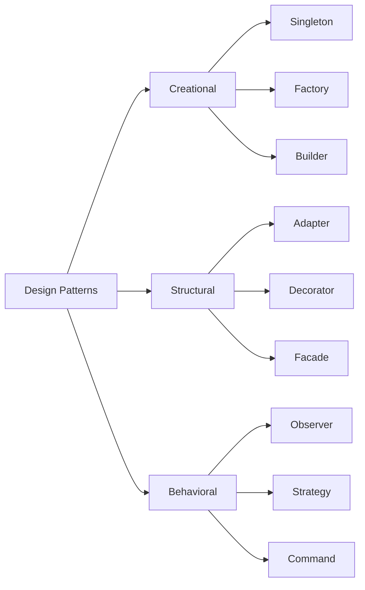

# 디자인 패턴 / Design Patterns

반복적으로 발생하는 소프트웨어 설계 문제에 대한 재사용 가능한 해결책입니다.

Reusable solutions to commonly occurring problems in software design.

## 🌟 선생님의 다정한 설명

### 🎈 초등학생 눈높이

여러분, 레고 설명서를 본 적 있죠? 레고 세트마다 **만드는 방법**이 정해져 있어요. 디자인 패턴도 마치 **프로그래밍의 레고 설명서**와 같아요!

예를 들어 볼게요:
- 🏭 **공장 패턴 (Factory):** 붕어빵 틀처럼, 같은 틀에서 팥 붕어빵도, 슈크림 붕어빵도 만들 수 있어요. 틀(Factory)은 하나인데 내용물만 바꾸면 되는 거죠!
- 👑 **싱글톤 (Singleton):** 학교에 교장 선생님은 한 분만 계시죠? 프로그램에서도 "딱 하나만 있어야 하는 것"을 만들 때 사용해요.
- 👀 **관찰자 패턴 (Observer):** 유튜브 구독 버튼! 구독하면 새 영상이 올라올 때 **자동으로 알림**이 오잖아요?

이런 **검증된 요리 레시피**처럼, 개발자들이 오랫동안 사용해서 "이 방법이 좋아!"라고 인정한 방법들이에요.

### 📐 중학생 눈높이

게임을 만들 때 디자인 패턴이 어떻게 쓰이는지 볼까요?

- **Factory 패턴:** 게임에서 몬스터를 생성할 때, `MonsterFactory.create("슬라임")`, `MonsterFactory.create("드래곤")`처럼 공장에서 다양한 몬스터를 찍어내요
- **Observer 패턴:** 플레이어의 체력이 변하면 → 체력바 UI 업데이트, 사운드 효과 재생, 게임 오버 체크 등이 **자동으로** 반응해요
- **Strategy 패턴:** NPC의 행동을 상황에 따라 바꿀 때, "공격 전략", "도망 전략", "대기 전략"을 쉽게 교체할 수 있어요
- **Singleton 패턴:** 게임 매니저, 사운드 매니저처럼 **전체 게임에서 하나만 있어야 하는 객체**

이런 패턴을 모르고 코딩하면 나중에 코드가 스파게티처럼 꼬여서 수정하기 정말 어려워져요!

### 🎓 고등학생 눈높이

1994년 "Gang of Four(GoF)"라고 불리는 4명의 저자가 **"Design Patterns: Elements of Reusable Object-Oriented Software"**라는 책에서 23가지 패턴을 정리했어요. 이 책은 소프트웨어 공학의 바이블로 불려요.

현업에서의 디자인 패턴:
- **Spring Framework**: Factory, Singleton, Proxy, Template Method 등 거의 모든 GoF 패턴을 활용해요
- **React**: Observer(상태 변화 감지), Strategy(렌더링 전략), Decorator(HOC) 패턴이 곳곳에 숨어 있어요
- 면접에서 "Observer 패턴을 설명해 보세요"와 같은 질문이 자주 나와요
- 패턴을 **과도하게** 사용하면 오히려 복잡해질 수 있어요 (Over-engineering)
- **안티패턴(Anti-pattern)**도 함께 알아야 진정한 설계 능력이 완성돼요

## 🔍 어떻게 작동하는지 알아볼까요?

디자인 패턴은 크게 3가지 카테고리로 나뉘어요:

**생성 패턴 (Creational) - "어떻게 만들까?"**
- **Singleton:** 인스턴스를 딱 하나만 만들고 전역에서 접근
- **Factory Method:** 객체 생성을 서브클래스에 위임
- **Builder:** 복잡한 객체를 단계별로 생성
- 핵심: 객체 생성의 **유연성**을 높여줘요

**구조 패턴 (Structural) - "어떻게 조합할까?"**
- **Adapter:** 호환되지 않는 인터페이스를 연결 (변환 플러그 같은 역할)
- **Decorator:** 기존 객체에 새 기능을 동적으로 추가 (토핑 추가하듯)
- **Facade:** 복잡한 시스템을 간단한 인터페이스로 감싸기
- 핵심: 클래스 간의 **관계를 깔끔하게** 만들어줘요

**행위 패턴 (Behavioral) - "어떻게 소통할까?"**
- **Observer:** 상태 변화를 자동으로 알려주기 (구독 시스템)
- **Strategy:** 알고리즘을 런타임에 교체 가능하게 만들기
- **Command:** 요청을 객체로 캡슐화 (Undo/Redo 구현)
- 핵심: 객체 간의 **책임과 통신**을 정리해줘요

## GoF 23가지 패턴 분류

| 분류 | 패턴 예시 | 목적 |
|------|-----------|------|
| 생성 | Singleton, Factory, Builder | 객체 생성 방식 제어 |
| 구조 | Adapter, Decorator, Facade | 클래스 조합 구조화 |
| 행위 | Observer, Strategy, Command | 객체 간 책임 분배 |

### 🌟 선생님의 관찰 노트

- **관찰 내용:** 다이어그램에서 Design Patterns가 세 갈래(Creational, Structural, Behavioral)로 나뉘고, 각각 대표적인 패턴들이 연결되어 있는 것이 보이나요? 마치 나무의 줄기에서 가지가 뻗어나가는 구조예요.
- **관찰 결과:** 디자인 패턴은 **문제의 유형에 따라 분류**돼요. "무엇을 만들어야 할 때", "어떻게 조합해야 할 때", "어떻게 소통해야 할 때" — 각각의 상황에 맞는 검증된 해결책이 준비되어 있답니다. 하나의 패턴만 아는 것보다 전체 분류를 이해하고 상황에 맞게 선택하는 것이 중요해요.
- **연결 질문:** "디자인 패턴을 많이 사용할수록 좋은 코드일까요? '심플한 코드'와 '패턴을 잘 적용한 코드' 중 어떤 것이 더 좋은 코드일까요?"

## 🔗 개념 연결 고리

- ➡️ **SOLID 원칙** (solid-principles): SOLID을 잘 따르면 자연스럽게 디자인 패턴이 적용돼요
- ➡️ **UML 클래스 다이어그램** (uml-class-diagram): 디자인 패턴의 구조를 시각적으로 표현할 때 사용해요
- ➡️ **UML 시퀀스 다이어그램** (uml-sequence-diagram): 패턴의 동적 행위를 표현해요
- ➡️ **마이크로서비스 아키텍처** (microservices-architecture): 대규모 시스템에서 패턴이 어떻게 적용되는지 볼 수 있어요

## 실생활 활용

- **프레임워크 아키텍처 설계** - Spring, Django, React 같은 프레임워크는 디자인 패턴의 집합체예요. 프레임워크를 깊이 이해하려면 패턴 지식이 필수랍니다.
- **확장 가능한 코드 작성** - 새 기능을 추가할 때 기존 코드를 수정하지 않고 확장할 수 있어요. Strategy 패턴으로 결제 수단을 추가하거나, Observer 패턴으로 알림 채널을 추가하는 것처럼요.
- **코드 리뷰 기준** - "이 부분은 Factory 패턴으로 리팩토링하면 좋겠어요"처럼 팀 내 커뮤니케이션이 효율적이 돼요. 공통 언어(vocabulary)로서의 역할이 크답니다.
- **기술 면접 준비** - "Singleton 패턴의 장단점은?", "Observer와 Pub/Sub의 차이는?" 같은 질문이 자주 나와요.
- **게임 개발** - 게임 엔진 내부는 디자인 패턴의 보물창고예요. Component, State, Command 패턴 등이 핵심적으로 사용돼요!
