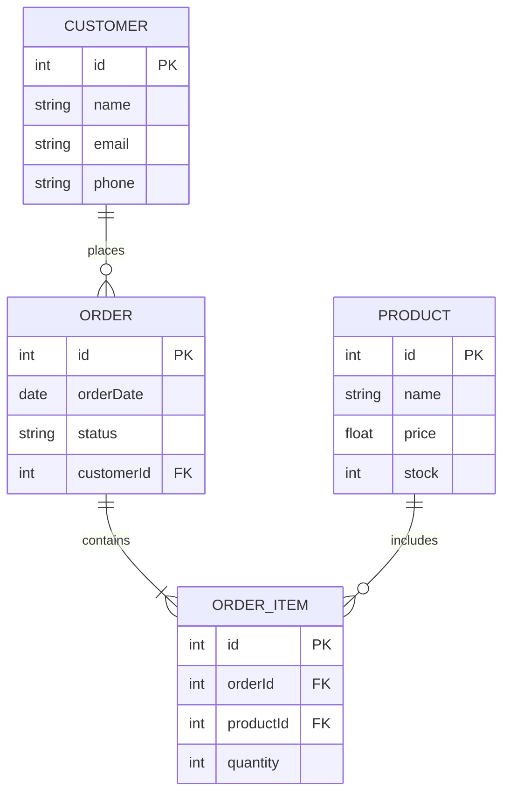

# ER 다이어그램 / ER Diagram

데이터베이스의 엔티티(개체), 속성, 관계를 시각적으로 표현하는 다이어그램입니다.

A diagram that visually represents entities, attributes, and relationships in a database.



## 관계 표기법

| 기호 | 의미 |
|------|------|
| `\|\|--o{` | 1 : N (일대다) |
| `\|\|--\|\|` | 1 : 1 (일대일) |
| `}o--o{` | N : M (다대다) |

```math-anim
type: er-diagram
params:
  entities: { default: 4, min: 2, max: 8, step: 1, label: { kr: "엔티티 수", en: "Entities" } }
  showAttributes: { default: true, label: { kr: "속성 표시", en: "Show Attributes" } }
```

## 실생활 활용

- **데이터베이스 설계**
- **비즈니스 요구사항 분석**
- **ORM 모델 정의**
