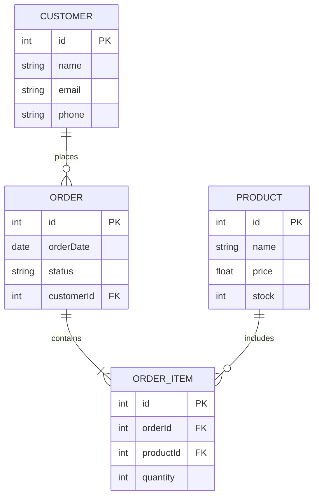

# ER 다이어그램 / ER Diagram

데이터베이스의 엔티티(개체), 속성, 관계를 시각적으로 표현하는 다이어그램입니다.

A diagram that visually represents entities, attributes, and relationships in a database.

## 🌟 선생님의 다정한 설명

### 🎈 초등학생 눈높이

여러분, **학교 출석부**를 생각해 봐요! 출석부에는 이런 정보가 있죠:
- 📝 **학생**: 이름, 반, 번호
- 👩‍🏫 **선생님**: 이름, 담당 과목
- 📖 **수업**: 과목명, 교실, 시간

그리고 이들 사이에 **관계**가 있어요:
- 한 명의 선생님이 **여러 수업**을 해요 (1:N)
- 한 수업에 **여러 학생**이 참여해요 (N:M)

이렇게 **정보(데이터)와 관계를 정리한 그림**이 ER 다이어그램이에요! 마치 **친구 관계도**를 그리는 것처럼, 데이터의 관계도를 그리는 거예요.

### 📐 중학생 눈높이

여러분이 **학교 도서관 시스템**을 만든다고 해 봐요:

- **학생 (Student):** id, 이름, 학년, 반
- **도서 (Book):** id, 제목, 저자, ISBN
- **대출 (Rental):** id, 대출일, 반납일, 학생id, 도서id

관계를 보면:
- 한 명의 학생이 여러 권을 빌릴 수 있어요 → **1:N**
- 한 권의 책이 여러 학생에게 빌려질 수 있어요 → **1:N**
- 결국 학생과 도서는 대출 테이블을 통해 **N:M** 관계!

ER 다이어그램은 이런 관계를 **코딩하기 전에** 그림으로 설계하는 거예요. 데이터베이스의 설계도라고 할 수 있죠! 마치 마인크래프트에서 건물 설계도를 먼저 그리는 것처럼요.

### 🎓 고등학생 눈높이

ER 다이어그램은 1976년 Peter Chen이 제안한 **데이터 모델링의 표준 도구**예요:

- **관계형 데이터베이스(RDBMS)**의 테이블 설계에 직접 사용돼요
- **정규화** 과정을 거치면서 ER 다이어그램이 수정되고 최적화돼요
- **DBA(데이터베이스 관리자)**, **데이터 엔지니어** 직군의 핵심 역량이에요
- 실무에서는 ERDCloud, dbdiagram.io, MySQL Workbench 등의 도구를 사용해요
- **PK(Primary Key), FK(Foreign Key)** 개념은 데이터 무결성의 핵심이에요
- ORM(Object-Relational Mapping)이 ER 다이어그램과 클래스 다이어그램을 연결해줘요
- NoSQL 데이터베이스에서는 ER 다이어그램 대신 다른 모델링 기법을 사용하기도 해요

## 🔍 어떻게 작동하는지 알아볼까요?

ER 다이어그램의 핵심 구성 요소를 살펴볼게요:

**엔티티 (Entity) - "무엇을 저장할까?"**
- 데이터베이스에 저장할 **대상**이에요
- 예: CUSTOMER, ORDER, PRODUCT
- 각 엔티티는 하나의 **테이블**이 돼요

**속성 (Attribute) - "어떤 정보를 저장할까?"**
- 엔티티의 **세부 정보**예요
- PK (Primary Key): 고유 식별자 (예: id)
- FK (Foreign Key): 다른 테이블과의 연결 고리
- 예: CUSTOMER의 name, email, phone

**관계 (Relationship) - "어떻게 연결돼 있을까?"**
- **1:1 (일대일):** 사용자 ↔ 프로필 (한 사용자에 하나의 프로필)
- **1:N (일대다):** 고객 ↔ 주문 (한 고객이 여러 주문)
- **N:M (다대다):** 학생 ↔ 수업 (여러 학생이 여러 수업을 들음)

**N:M 관계 처리:**
- 다대다 관계는 직접 구현할 수 없어서, **중간 테이블(조인 테이블)**을 만들어요
- 예: ORDER_ITEM이 ORDER와 PRODUCT 사이의 중간 테이블이에요



## 관계 표기법

| 기호 | 의미 |
|------|------|
| `\|\|--o{` | 1 : N (일대다) |
| `\|\|--\|\|` | 1 : 1 (일대일) |
| `}o--o{` | N : M (다대다) |

```math-anim
type: er-diagram
params:
  entities: { default: 4, min: 2, max: 8, step: 1, label: { kr: "엔티티 수", en: "Entities" } }
  showAttributes: { default: true, label: { kr: "속성 표시", en: "Show Attributes" } }
```

### 🌟 선생님의 관찰 노트

- **관찰 내용:** 다이어그램에서 CUSTOMER, ORDER, PRODUCT, ORDER_ITEM 네 개의 엔티티가 서로 연결되어 있는 것이 보이나요? 각 엔티티 안에 PK(Primary Key)와 FK(Foreign Key)가 표시되어 있고, 연결선의 기호(`||--o{`)로 관계의 종류를 알 수 있어요.
- **관찰 결과:** ER 다이어그램은 **데이터의 구조와 관계**를 한눈에 보여줘요. ORDER_ITEM이 ORDER와 PRODUCT 사이에 위치한 것에 주목하세요 — 이것이 **다대다(N:M) 관계를 풀어내는 중간 테이블**이에요. 실무에서 가장 자주 만나는 패턴이랍니다.
- **연결 질문:** "만약 한 고객이 같은 상품을 여러 번 다른 수량으로 주문한다면, 이 ER 다이어그램으로 그 데이터를 정확히 저장할 수 있을까요? ORDER_ITEM의 역할에 대해 생각해 보세요."

## 🔗 개념 연결 고리

- ➡️ **데이터베이스 정규화** (database-normalization): ER 다이어그램으로 설계한 뒤, 정규화를 통해 데이터 중복을 제거해요
- ➡️ **UML 클래스 다이어그램** (uml-class-diagram): ER 다이어그램의 엔티티가 클래스가 되고, 관계가 참조가 돼요
- ↔️ **ORM (Object-Relational Mapping)**: ER 다이어그램의 테이블을 코드의 클래스로 자동 매핑해줘요
- ➡️ **마이크로서비스 아키텍처** (microservices-architecture): 서비스별로 독립적인 ER 다이어그램을 가져요

## 실생활 활용

- **데이터베이스 설계** - 모든 서비스의 백엔드는 데이터베이스로 시작해요. ER 다이어그램으로 테이블 구조를 먼저 설계하면, 나중에 테이블 수정으로 인한 대규모 마이그레이션을 줄일 수 있어요.
- **비즈니스 요구사항 분석** - "고객은 여러 주문을 할 수 있고, 각 주문에는 여러 상품이 포함된다"와 같은 비즈니스 규칙을 ER 다이어그램으로 시각화하면, 개발자와 기획자가 같은 이해를 공유할 수 있어요.
- **ORM 모델 정의** - Django의 models.py, Spring의 @Entity 클래스를 작성하기 전에 ER 다이어그램을 그려놓으면, ORM 코드가 자연스럽게 나와요.
- **쇼핑몰 설계** - 상품, 카테고리, 장바구니, 주문, 결제, 배송, 리뷰... 복잡한 관계를 ER 다이어그램 없이 설계하면 나중에 큰 고생을 해요!
- **SNS 서비스** - 사용자, 게시글, 댓글, 좋아요, 팔로우 관계를 ER 다이어그램으로 모델링하는 것은 기본 중의 기본이에요!
