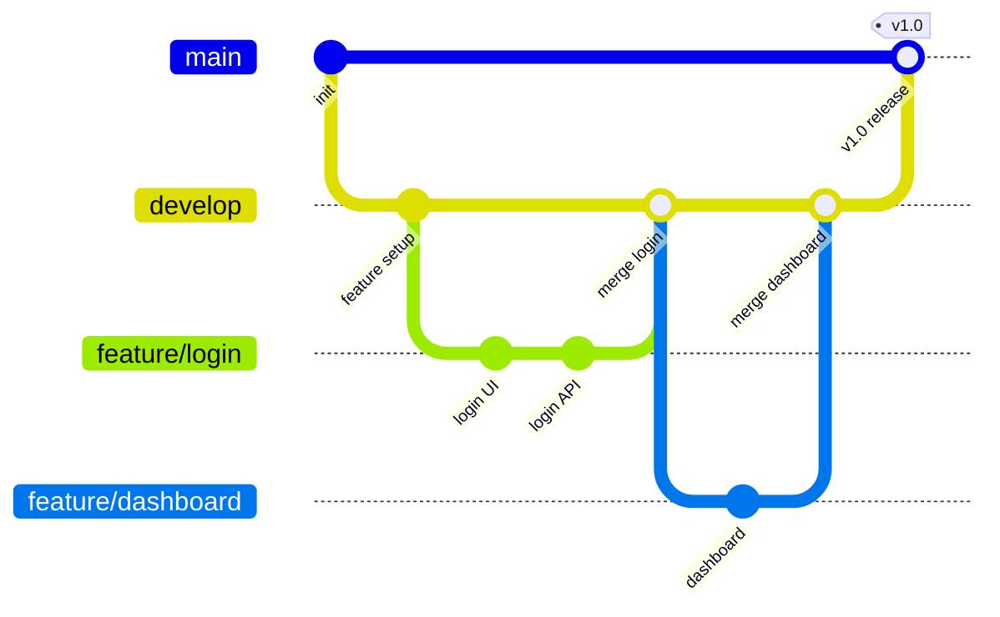

# Git 워크플로우 / Git Workflow

팀 협업을 위한 Git 브랜치 전략과 코드 병합 프로세스입니다.

Git branching strategies and code merging processes for team collaboration.

## 🌟 선생님의 다정한 설명

### 🎈 초등학생 눈높이

여러분, 친구들과 함께 **그림 이어 그리기**를 해본 적 있나요? Git 워크플로우는 이것과 비슷해요!

큰 도화지에 그림을 그리는데, 여러 명이 동시에 하면 서로 방해가 되잖아요? 그래서 이렇게 해요:
1. **원본 그림**이 있어요 (main 브랜치)
2. 각자 **복사본**을 가져가서 자기 부분을 그려요 (feature 브랜치)
3. 다 그리면 원본에 **합쳐요** (merge)

마치 요리 수업에서 각자 재료를 준비하고, 마지막에 모두 합쳐서 하나의 요리를 완성하는 것처럼요! 만약 두 명이 같은 부분을 다르게 그렸다면? 선생님(팀 리더)이 어떤 것이 더 좋은지 골라주는 거예요. 이걸 **충돌 해결**이라고 해요.

### 📐 중학생 눈높이

여러분이 친구 4명과 함께 **학교 웹사이트**를 만든다고 생각해 봐요:

- **민수**: 로그인 페이지 담당 → `feature/login` 브랜치에서 작업
- **지은**: 게시판 담당 → `feature/board` 브랜치에서 작업
- **서준**: 갤러리 담당 → `feature/gallery` 브랜치에서 작업
- **하은**: 메인 페이지 담당 → `feature/main-page` 브랜치에서 작업

모두 각자의 브랜치에서 자유롭게 코딩하고, 완성되면 `develop` 브랜치에 합쳐요. 모든 기능이 합쳐지고 테스트까지 통과하면 `main` 브랜치로 **릴리스**하는 거예요!

이렇게 하면 서로의 코드를 **방해하지 않으면서** 동시에 개발할 수 있어요. 마인크래프트에서 친구들과 각자 다른 건물을 짓고 나중에 하나의 마을로 합치는 것과 비슷하죠?

### 🎓 고등학생 눈높이

실제 기업에서 Git 워크플로우는 **팀 생산성의 핵심**이에요:

- **오픈소스 프로젝트**: Linux 커널은 수천 명의 개발자가 Git으로 협업해요. Linus Torvalds가 Git을 만든 이유가 바로 이 대규모 협업 때문이었죠
- **코드 리뷰**: Pull Request(PR)를 통해 다른 개발자가 코드를 검토해요. 이것이 코드 품질을 유지하는 핵심 장치예요
- **Git Flow vs GitHub Flow vs Trunk-Based**: 팀 규모와 배포 주기에 따라 전략이 달라져요
- **DevOps 엔지니어, 백엔드 개발자** 등 거의 모든 개발 직군에서 Git은 필수 역량이에요
- GitHub, GitLab 같은 플랫폼의 활용 능력이 채용 시 중요한 평가 요소가 됩니다

## 🔍 어떻게 작동하는지 알아볼까요?

Git 워크플로우의 핵심 흐름을 단계별로 살펴볼게요:

**1단계: 브랜치 생성**
- `main` 브랜치에서 새로운 기능을 위한 브랜치를 만들어요
- 예: `git checkout -b feature/login`

**2단계: 작업 및 커밋**
- 코드를 수정하고, 의미 있는 단위로 커밋해요
- 좋은 커밋 메시지: "Add login form validation" (무엇을 왜 했는지)

**3단계: Push & Pull Request**
- 작업한 브랜치를 원격 저장소에 Push하고
- PR(Pull Request)을 열어서 코드 리뷰를 요청해요

**4단계: 코드 리뷰**
- 다른 팀원이 코드를 검토하고 피드백을 남겨요
- 수정 사항이 있으면 추가 커밋 후 다시 리뷰받아요

**5단계: 병합 (Merge)**
- 리뷰가 승인되면 대상 브랜치(develop 또는 main)에 병합해요
- 충돌이 있으면 해결하고 병합해요

**6단계: 릴리스**
- develop에 쌓인 기능들을 main으로 병합하여 릴리스해요
- 태그를 붙여서 버전을 관리해요: `v1.0.0`



## 주요 브랜치 전략

| 전략 | 특징 | 적합한 팀 |
|------|------|-----------|
| Git Flow | main/develop/feature/release/hotfix | 대규모 팀 |
| GitHub Flow | main + feature branch | 소규모 팀 |
| Trunk-Based | main 직접 커밋 + feature flag | 고성능 팀 |

```math-anim
type: git-workflow
params:
  branches: { default: 4, min: 2, max: 8, step: 1, label: { kr: "브랜치 수", en: "Branches" } }
  commits: { default: 8, min: 3, max: 15, step: 1, label: { kr: "커밋 수", en: "Commits" } }
  showMerge: { default: true, label: { kr: "병합 표시", en: "Show Merge" } }
  animate: { default: true, label: { kr: "애니메이션", en: "Animate" } }
```

### 🌟 선생님의 관찰 노트

- **관찰 내용:** Git 그래프에서 `main`에서 `develop`이 갈라지고, `develop`에서 다시 `feature/login`, `feature/dashboard` 등이 갈라졌다가 다시 합쳐지는 모습이 보이나요? 마치 나뭇가지처럼 갈라졌다가 모이는 형태예요.
- **관찰 결과:** Git의 브랜치는 **독립적인 작업 공간**을 제공하면서도, 언제든지 다시 합칠 수 있는 유연성을 가져요. 태그(`v1.0`)가 붙은 지점이 실제 사용자에게 배포된 버전이에요. 브랜치 수를 늘려보면 동시 작업이 어떻게 관리되는지 더 잘 볼 수 있답니다.
- **연결 질문:** "만약 두 명의 개발자가 같은 파일의 같은 줄을 수정했다면 어떻게 될까요? 이런 '충돌(conflict)'을 미리 방지하려면 어떤 규칙을 만들면 좋을까요?"

## 🔗 개념 연결 고리

- ➡️ **CI/CD 파이프라인** (cicd-pipeline): 브랜치에 Push하면 자동으로 빌드·테스트가 실행돼요
- ➡️ **애자일 방법론** (agile-methodology): 스프린트마다 feature 브랜치를 생성하고 병합하는 흐름이 연결돼요
- ➡️ **SDLC** (sdlc): Git 워크플로우는 SDLC의 구현-테스트-배포 단계를 기술적으로 지원해요
- ↔️ **코드 리뷰**: PR 기반의 코드 리뷰는 소프트웨어 품질을 유지하는 핵심 활동이에요

## 실생활 활용

- **오픈소스 프로젝트 기여** - GitHub에서 유명한 프로젝트에 기여할 때 Fork → Branch → PR의 흐름을 따라요. 여러분도 좋아하는 오픈소스에 기여해 보세요! 포트폴리오에도 큰 도움이 돼요.
- **팀 코드 리뷰 프로세스** - PR을 통한 코드 리뷰는 버그를 사전에 잡고 코드 품질을 높여요. 카카오, 네이버 같은 기업에서는 최소 2명 이상의 리뷰 승인이 필요한 규칙을 적용해요.
- **릴리스 관리** - 앱 버전(v1.0, v1.1, v2.0)을 Git 태그로 관리하면, 문제가 생겼을 때 이전 버전으로 빠르게 되돌릴 수 있어요.
- **포트폴리오 관리** - 개인 프로젝트도 Git으로 관리하면 성장 과정이 기록되고, 취업 시 GitHub 프로필이 이력서 역할을 해줘요.
- **문서 협업** - 코드뿐 아니라 기술 문서, 설정 파일도 Git으로 버전 관리할 수 있어요!
