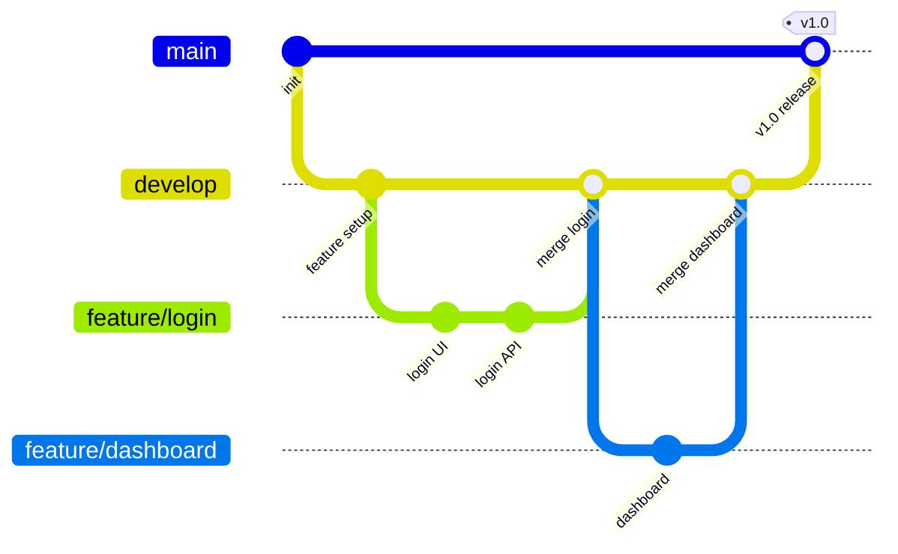

# Git 워크플로우 / Git Workflow

팀 협업을 위한 Git 브랜치 전략과 코드 병합 프로세스입니다.

Git branching strategies and code merging processes for team collaboration.



## 주요 브랜치 전략

| 전략 | 특징 | 적합한 팀 |
|------|------|-----------|
| Git Flow | main/develop/feature/release/hotfix | 대규모 팀 |
| GitHub Flow | main + feature branch | 소규모 팀 |
| Trunk-Based | main 직접 커밋 + feature flag | 고성능 팀 |

```math-anim
type: git-workflow
params:
  branches: { default: 4, min: 2, max: 8, step: 1, label: { kr: "브랜치 수", en: "Branches" } }
  commits: { default: 8, min: 3, max: 15, step: 1, label: { kr: "커밋 수", en: "Commits" } }
  showMerge: { default: true, label: { kr: "병합 표시", en: "Show Merge" } }
  animate: { default: true, label: { kr: "애니메이션", en: "Animate" } }
```

## 실생활 활용

- **오픈소스 프로젝트 기여**
- **팀 코드 리뷰 프로세스**
- **릴리스 관리**
