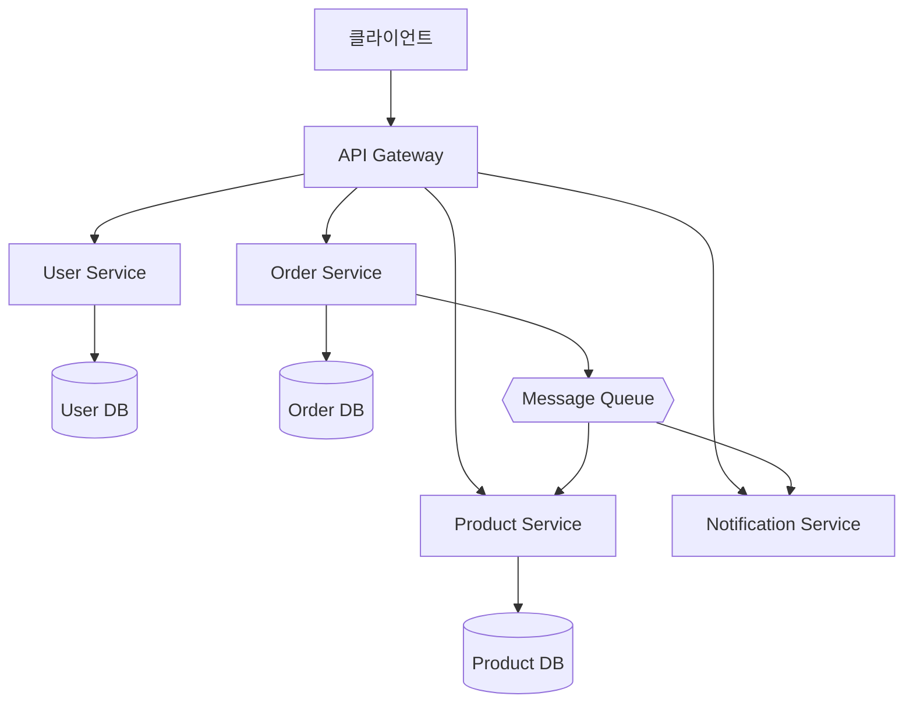

# 마이크로서비스 아키텍처 / Microservices Architecture

하나의 애플리케이션을 독립적으로 배포 가능한 작은 서비스들의 집합으로 구성하는 아키텍처 스타일입니다.

An architectural style where an application is composed of small, independently deployable services.

## 🌟 선생님의 다정한 설명

### 🎈 초등학생 눈높이

여러분, **푸드코트**에 가본 적 있나요? 한식, 중식, 일식, 양식 가게가 각각 따로 있고, 각 가게가 **독립적으로 운영**되잖아요!

- 🍜 **한식 가게**: 불고기, 비빔밥 담당
- 🍕 **양식 가게**: 파스타, 피자 담당
- 🍣 **일식 가게**: 초밥, 라멘 담당
- 💰 **계산대**: 모든 주문의 결제 담당

각 가게는 따로따로 운영되지만, 손님은 하나의 푸드코트에서 **다양한 음식을 즐길 수 있어요**!

만약 이것이 **하나의 큰 식당**이라면? 주방장 한 명이 한식, 양식, 일식을 다 만들어야 해서 너무 바쁘겠죠? 그리고 한식 메뉴를 바꾸려면 다른 메뉴도 다 영향받을 수 있어요.

마이크로서비스는 **각각 독립적인 작은 가게들이 모여서 큰 서비스를 만드는 방식**이에요!

### 📐 중학생 눈높이

여러분이 **쿠팡 같은 쇼핑몰**을 만든다고 해 봐요:

**모놀리식 (하나로 다 만들기):**
- 하나의 거대한 앱에 회원, 상품, 주문, 결제, 배송, 리뷰가 다 들어있어요
- 상품 페이지를 수정하려면 전체를 다시 배포해야 해요
- 결제 부분에 버그가 생기면 전체 서비스가 다운될 수 있어요

**마이크로서비스 (나눠서 만들기):**
- 👤 회원 서비스, 📦 상품 서비스, 🛒 주문 서비스, 💳 결제 서비스, 🚚 배송 서비스가 각각 따로!
- 상품 서비스만 업데이트할 수 있어요
- 결제 서비스에 문제가 생겨도 상품 검색은 정상 작동!

각 서비스는 **자기만의 데이터베이스**를 갖고, 서비스 간에는 **API로 통신**해요. 마치 각 가게가 자기 냉장고와 메뉴판을 갖고, 주문은 메신저로 전달하는 것처럼요!

### 🎓 고등학생 눈높이

마이크로서비스 아키텍처는 **대규모 시스템의 현대적 표준**이에요:

- **Netflix**: 700개 이상의 마이크로서비스로 구성. 서비스 장애 시 Circuit Breaker 패턴으로 전체 시스템을 보호해요
- **Amazon**: 수천 개의 마이크로서비스, 팀별로 독립적 배포 (Two-Pizza Team 규칙)
- **기술 스택의 자유**: 사용자 서비스는 Java, 추천 서비스는 Python, 실시간 채팅은 Go로 각각 다른 언어를 사용할 수 있어요
- **API Gateway**: 클라이언트의 요청을 적절한 서비스로 라우팅하는 진입점
- **Message Queue (Kafka, RabbitMQ)**: 서비스 간 비동기 통신을 담당
- **컨테이너(Docker) + 오케스트레이션(Kubernetes)**가 마이크로서비스 운영의 핵심 기술이에요
- **SRE(Site Reliability Engineer), 클라우드 아키텍트** 같은 직군이 마이크로서비스 인프라를 관리해요

## 🔍 어떻게 작동하는지 알아볼까요?

마이크로서비스 아키텍처의 작동 흐름을 살펴볼게요:

**1. 클라이언트 요청**
- 사용자가 앱이나 웹에서 "상품 주문"을 해요
- 이 요청은 **API Gateway**로 먼저 전달돼요

**2. API Gateway (교통 경찰 역할)**
- 요청을 분석해서 적절한 서비스로 라우팅해요
- 인증, 로깅, 속도 제한(Rate Limiting) 등도 담당해요

**3. 서비스 간 통신**
- **동기 통신 (REST/gRPC):** 주문 서비스가 상품 서비스에 재고 확인 요청 → 바로 응답 받기
- **비동기 통신 (Message Queue):** 주문 완료 이벤트를 메시지 큐에 넣으면 → 알림 서비스가 나중에 처리

**4. 독립적 데이터베이스**
- 각 서비스는 **자기만의 DB**를 가져요
- User Service → User DB, Order Service → Order DB
- 서비스 간 데이터가 필요하면 API로 요청해요

**5. 장애 격리**
- 하나의 서비스가 죽어도 다른 서비스는 계속 동작해요
- **Circuit Breaker 패턴**: 장애가 전파되는 것을 방지해요
- 마치 집의 한 방에 문제가 생겨도 다른 방은 괜찮은 것처럼!

**6. 독립 배포**
- 각 서비스를 개별적으로 배포할 수 있어요
- CI/CD 파이프라인이 서비스별로 독립적으로 운영돼요



## Monolith vs Microservices

| 항목 | 모놀리식 | 마이크로서비스 |
|------|---------|--------------|
| 배포 | 전체 재배포 | 서비스별 독립 배포 |
| 확장 | 전체 스케일링 | 서비스별 스케일링 |
| 기술 스택 | 단일 | 서비스별 선택 가능 |
| 복잡성 | 낮음 (초기) | 높음 (운영) |

```math-anim
type: microservices-architecture
params:
  services: { default: 5, min: 2, max: 10, step: 1, label: { kr: "서비스 수", en: "Services" } }
  traffic: { default: 50, min: 10, max: 200, step: 10, label: { kr: "요청량 (req/s)", en: "Traffic (req/s)" } }
  showMessages: { default: true, label: { kr: "메시지 흐름", en: "Message Flow" } }
  animate: { default: true, label: { kr: "애니메이션", en: "Animate" } }
```

### 🌟 선생님의 관찰 노트

- **관찰 내용:** 다이어그램에서 API Gateway가 모든 서비스의 진입점 역할을 하고, 각 서비스가 자기만의 데이터베이스를 가지고 있는 것이 보이나요? Message Queue를 통해 Order Service → Notification Service, Product Service로 비동기 메시지가 전달되는 흐름도 확인해 보세요. 서비스 수와 트래픽을 조절하면 시스템 부하가 어떻게 변하는지도 관찰할 수 있어요.
- **관찰 결과:** 마이크로서비스의 핵심은 **독립성**이에요. 각 서비스가 독립적인 DB를 가지고, 독립적으로 배포되며, 장애도 독립적으로 격리돼요. 하지만 이 독립성은 **분산 시스템의 복잡성**이라는 대가를 치러야 해요. 서비스 간 통신, 데이터 일관성, 분산 트랜잭션 등 새로운 도전이 생기죠.
- **연결 질문:** "모든 서비스를 마이크로서비스로 나누면 무조건 좋을까요? 서비스 2~3개뿐인 작은 프로젝트에서도 마이크로서비스가 적합할까요? '적절한 크기'를 어떻게 결정할 수 있을까요?"

## 🔗 개념 연결 고리

- ➡️ **CI/CD 파이프라인** (cicd-pipeline): 서비스별 독립 배포를 위해 CI/CD가 필수예요
- ➡️ **디자인 패턴** (design-patterns): API Gateway, Circuit Breaker, Saga 등 마이크로서비스 전용 패턴이 있어요
- ➡️ **ER 다이어그램** (er-diagram): 서비스별로 독립적인 데이터 모델(ER 다이어그램)을 가져요
- ➡️ **SDLC** (sdlc): 마이크로서비스에서는 서비스별로 SDLC가 독립적으로 돌아가요

## 실생활 활용

- **Netflix, Amazon, Uber** - Netflix는 700개 이상의 마이크로서비스로 운영돼요. 추천 알고리즘 서비스, 스트리밍 서비스, 결제 서비스가 각각 독립적이라서, 추천 엔진을 업데이트해도 영상 재생에는 영향이 없어요.
- **대규모 SaaS 플랫폼** - Shopify, Slack, Zoom 같은 SaaS도 마이크로서비스로 구성돼요. 특정 기능의 트래픽이 폭주하면 해당 서비스만 스케일 업/아웃할 수 있어서 비용 효율적이에요.
- **독립 팀 운영 조직** - Amazon의 "Two-Pizza Team" 규칙처럼, 서비스 하나를 피자 두 판으로 먹을 수 있는 규모의 팀이 담당해요. 팀 간 의존성이 줄어들어 의사결정이 빨라져요.
- **이커머스 플랫폼** - 쿠팡, 배달의민족에서 상품 검색은 Elasticsearch 기반 서비스, 결제는 PG 연동 서비스, 배송 추적은 물류 서비스로 분리되어 있어요.
- **게임 백엔드** - 매칭 서비스, 채팅 서비스, 상점 서비스를 분리하면 동시접속자가 폭증해도 매칭 서비스만 확장하면 돼요!
