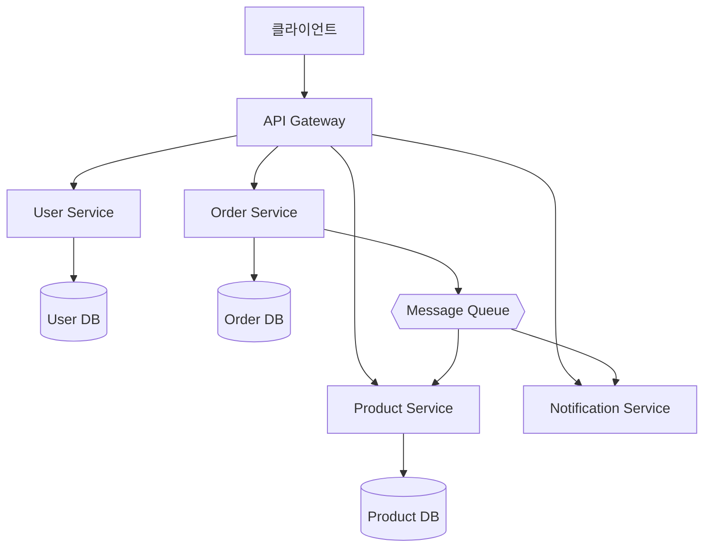

# 마이크로서비스 아키텍처 / Microservices Architecture

하나의 애플리케이션을 독립적으로 배포 가능한 작은 서비스들의 집합으로 구성하는 아키텍처 스타일입니다.

An architectural style where an application is composed of small, independently deployable services.



## Monolith vs Microservices

| 항목 | 모놀리식 | 마이크로서비스 |
|------|---------|--------------|
| 배포 | 전체 재배포 | 서비스별 독립 배포 |
| 확장 | 전체 스케일링 | 서비스별 스케일링 |
| 기술 스택 | 단일 | 서비스별 선택 가능 |
| 복잡성 | 낮음 (초기) | 높음 (운영) |

```math-anim
type: microservices-architecture
params:
  services: { default: 5, min: 2, max: 10, step: 1, label: { kr: "서비스 수", en: "Services" } }
  traffic: { default: 50, min: 10, max: 200, step: 10, label: { kr: "요청량 (req/s)", en: "Traffic (req/s)" } }
  showMessages: { default: true, label: { kr: "메시지 흐름", en: "Message Flow" } }
  animate: { default: true, label: { kr: "애니메이션", en: "Animate" } }
```

## 실생활 활용

- **Netflix, Amazon, Uber**
- **대규모 SaaS 플랫폼**
- **독립 팀 운영 조직**
