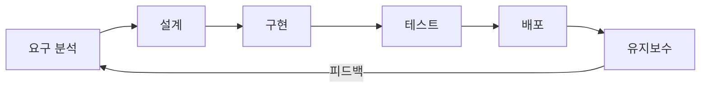

# 소프트웨어 개발 생명주기 / SDLC

소프트웨어를 계획, 개발, 테스트, 배포, 유지보수하는 전체 과정을 체계적으로 정의한 프레임워크입니다.

A framework defining the process of planning, developing, testing, deploying, and maintaining software.

## 🌟 선생님의 다정한 설명

### 🎈 초등학생 눈높이

여러분, 학교에서 요리 실습을 해본 적 있나요? 소프트웨어 개발 생명주기(SDLC)는 마치 **맛있는 케이크를 만드는 과정**과 같아요!

1. **레시피 정하기** (요구 분석) - "어떤 케이크를 만들까? 초콜릿? 딸기?"
2. **재료 준비하기** (설계) - "밀가루, 설탕, 계란... 뭐가 필요하지?"
3. **반죽하고 굽기** (구현) - 실제로 케이크를 만들어요!
4. **맛보기** (테스트) - "음... 맛있나? 부족한 건 없나?"
5. **친구들에게 나눠주기** (배포) - 완성된 케이크를 함께 먹어요!
6. **다음에 더 잘 만들기** (유지보수) - "다음엔 크림을 더 넣어볼까?"

레고 블록으로 집을 만들 때도 마찬가지예요. 설계도를 보고 → 블록을 조립하고 → 잘 만들어졌는지 확인하고 → 친구에게 보여주는 것처럼요!

### 📐 중학생 눈높이

게임 하나를 만든다고 생각해 보세요. 여러분이 **모바일 게임 앱**을 직접 개발한다면 어떤 과정을 거칠까요?

1. **기획 회의** (요구 분석) - "어떤 장르? 타겟 유저는? 핵심 기능은?"
2. **화면 설계** (설계) - Figma로 UI 디자인, 데이터 구조 설계
3. **코딩** (구현) - Unity나 React Native로 실제 코드 작성
4. **QA 테스트** (테스트) - 버그 찾기, 여러 기기에서 동작 확인
5. **앱스토어 출시** (배포) - Google Play, App Store에 올리기
6. **업데이트** (유지보수) - 유저 피드백 반영, 새 기능 추가

SDLC는 이 모든 과정을 **체계적으로 관리**하는 프레임워크예요. 마치 게임의 진행 맵처럼, 어디까지 왔고 다음엔 뭘 해야 하는지 알려주는 가이드랍니다.

### 🎓 고등학생 눈높이

실제 IT 기업에서는 SDLC가 **프로젝트의 생존**을 좌우합니다. 삼성SDS, 카카오, 네이버 같은 기업에서는 수천 명의 개발자가 동시에 일하기 때문에, 체계적인 개발 프로세스 없이는 혼란이 발생하죠.

- **PM(프로젝트 매니저)** 직군은 SDLC 전체를 관리하는 역할을 합니다
- **요구 분석** 단계에서 잘못 정의하면 전체 프로젝트가 실패할 수 있어요 (통계적으로 실패 원인의 40%가 요구사항 문제!)
- 현대 기업들은 전통적 SDLC를 기반으로 **애자일**, **DevOps** 등으로 발전시켜 사용합니다
- 소프트웨어 공학, 컴퓨터 과학 전공에서 SDLC는 필수 학습 내용이에요

## 🔍 어떻게 작동하는지 알아볼까요?

SDLC는 6단계의 순환 구조로 작동해요. 하나씩 살펴볼까요?

**1단계: 요구 분석 (Requirements Analysis)**
- 고객이나 사용자에게 "무엇을 원하시나요?"라고 물어보는 단계예요
- 기능 요구사항(무엇을 해야 하는가)과 비기능 요구사항(얼마나 빨라야 하는가)을 정리해요

**2단계: 설계 (Design)**
- 요구사항을 바탕으로 시스템의 **청사진**을 그려요
- 아키텍처 설계, 데이터베이스 설계, UI/UX 설계 등이 포함돼요

**3단계: 구현 (Implementation)**
- 설계도를 보고 실제 코드를 작성하는 단계예요
- 프로그래밍 언어를 선택하고, 코딩 컨벤션을 따르며 개발해요

**4단계: 테스트 (Testing)**
- 만든 소프트웨어가 제대로 동작하는지 검증해요
- 단위 테스트 → 통합 테스트 → 시스템 테스트 → 인수 테스트 순서로 진행해요

**5단계: 배포 (Deployment)**
- 테스트를 통과한 소프트웨어를 실제 운영 환경에 올려요
- 사용자들이 실제로 사용할 수 있게 되는 순간이에요!

**6단계: 유지보수 (Maintenance)**
- 배포 후에도 끊임없이 관리해요
- 버그 수정, 성능 개선, 새로운 기능 추가가 계속 이루어져요

그리고 유지보수 단계에서 새로운 요구사항이 나오면? 다시 1단계로 돌아가요! 이렇게 **끝없이 순환**하는 것이 SDLC의 핵심이랍니다.



## 주요 단계

- **요구 분석**: 사용자 요구사항 수집 및 정의
- **설계**: 시스템 아키텍처 및 상세 설계
- **구현**: 코드 작성 및 단위 테스트
- **테스트**: 통합 테스트, 시스템 테스트, 인수 테스트
- **배포**: 운영 환경에 릴리스
- **유지보수**: 버그 수정, 기능 개선

```math-anim
type: sdlc
params:
  phase: { default: 1, min: 1, max: 6, step: 1, label: { kr: "단계", en: "Phase" } }
  showFlow: { default: true, label: { kr: "흐름도 보기", en: "Show Flow" } }
```

### 🌟 선생님의 관찰 노트

- **관찰 내용:** 다이어그램과 애니메이션에서 각 단계가 순서대로 연결되어 있고, 마지막 유지보수 단계에서 다시 요구 분석으로 돌아가는 화살표(피드백 루프)가 보이죠?
- **관찰 결과:** 소프트웨어 개발은 한 번에 끝나는 것이 아니라 **지속적으로 개선되는 순환 과정**이에요. 현실의 소프트웨어는 출시 후에도 계속 진화합니다. 유지보수 단계가 전체 비용의 60~80%를 차지한다는 사실이 이를 증명해요.
- **연결 질문:** "만약 테스트 단계를 건너뛰고 바로 배포한다면 어떤 일이 벌어질까요? 반대로, 요구 분석을 너무 오래 하면 어떤 문제가 생길까요?"

## 🔗 개념 연결 고리

- ➡️ **폭포수 모델** (waterfall-model): SDLC를 순차적으로 수행하는 전통적 방법론
- ➡️ **애자일 방법론** (agile-methodology): SDLC를 반복적·점진적으로 수행하는 현대적 방법론
- ➡️ **CI/CD 파이프라인** (cicd-pipeline): 구현-테스트-배포 단계를 자동화하는 기술
- ➡️ **테스트 전략** (testing-strategy): SDLC의 테스트 단계를 깊이 있게 다루는 개념

## 실생활 활용

- **기업 SI 프로젝트** - 대기업의 ERP, CRM 시스템을 구축할 때 SDLC의 모든 단계를 철저히 따라요. 수억 원 규모의 프로젝트에서 단계별 검증은 필수랍니다!
- **스타트업 MVP 개발** - 스타트업에서는 SDLC를 빠르게 순환시켜 최소 기능 제품(MVP)을 먼저 출시하고, 피드백을 받아 개선해요. "빠르게 실패하고 빠르게 배우자"가 모토예요.
- **정부 정보시스템 구축** - 정부 프로젝트는 예산과 일정이 엄격하기 때문에 SDLC 문서화가 매우 중요해요. 감사 대비 자료로도 활용되죠.
- **게임 개발** - 대형 게임사에서는 기획(요구 분석) → 프로토타입(설계/구현) → 알파/베타 테스트 → 정식 출시 → 패치의 흐름으로 SDLC를 따라요.
- **학교 프로젝트** - 학교에서 팀 프로젝트를 할 때도 SDLC를 적용하면 체계적으로 진행할 수 있어요!
