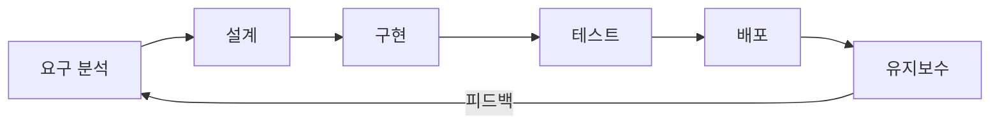

# 소프트웨어 개발 생명주기 / SDLC

소프트웨어를 계획, 개발, 테스트, 배포, 유지보수하는 전체 과정을 체계적으로 정의한 프레임워크입니다.

A framework defining the process of planning, developing, testing, deploying, and maintaining software.



## 주요 단계

- **요구 분석**: 사용자 요구사항 수집 및 정의
- **설계**: 시스템 아키텍처 및 상세 설계
- **구현**: 코드 작성 및 단위 테스트
- **테스트**: 통합 테스트, 시스템 테스트, 인수 테스트
- **배포**: 운영 환경에 릴리스
- **유지보수**: 버그 수정, 기능 개선

```math-anim
type: sdlc
params:
  phase: { default: 1, min: 1, max: 6, step: 1, label: { kr: "단계", en: "Phase" } }
  showFlow: { default: true, label: { kr: "흐름도 보기", en: "Show Flow" } }
```

## 실생활 활용

- **기업 SI 프로젝트**
- **스타트업 MVP 개발**
- **정부 정보시스템 구축**
