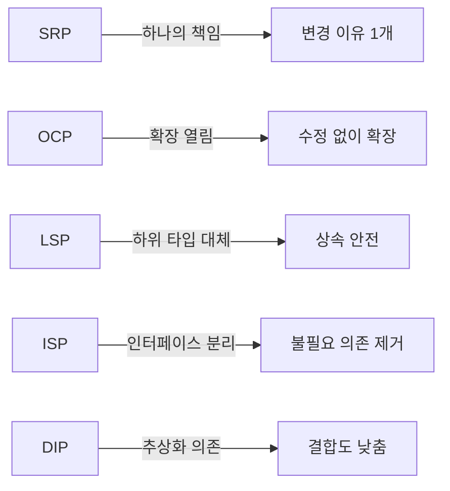

# SOLID 원칙 / SOLID Principles

객체지향 설계의 5가지 핵심 원칙으로, 유지보수 가능하고 확장 가능한 소프트웨어를 만드는 기본 지침입니다.

Five core principles of object-oriented design for building maintainable and scalable software.



## 각 원칙 요약

| 원칙 | 핵심 | 위반 시 문제 |
|------|------|-------------|
| SRP | 하나의 클래스 = 하나의 책임 | God Object 발생 |
| OCP | 기존 코드 수정 없이 확장 | 수정마다 버그 유발 |
| LSP | 자식 클래스가 부모를 대체 | 런타임 오류 |
| ISP | 필요한 인터페이스만 의존 | 불필요한 구현 강제 |
| DIP | 구체가 아닌 추상에 의존 | 높은 결합도 |

```math-anim
type: solid-principles
params:
  principle: { default: 1, min: 1, max: 5, step: 1, label: { kr: "원칙 번호", en: "Principle #" } }
  showViolation: { default: true, label: { kr: "위반 사례", en: "Show Violation" } }
```

## 실생활 활용

- **클린 코드 작성**
- **코드 리뷰 체크리스트**
- **시스템 리팩토링**
