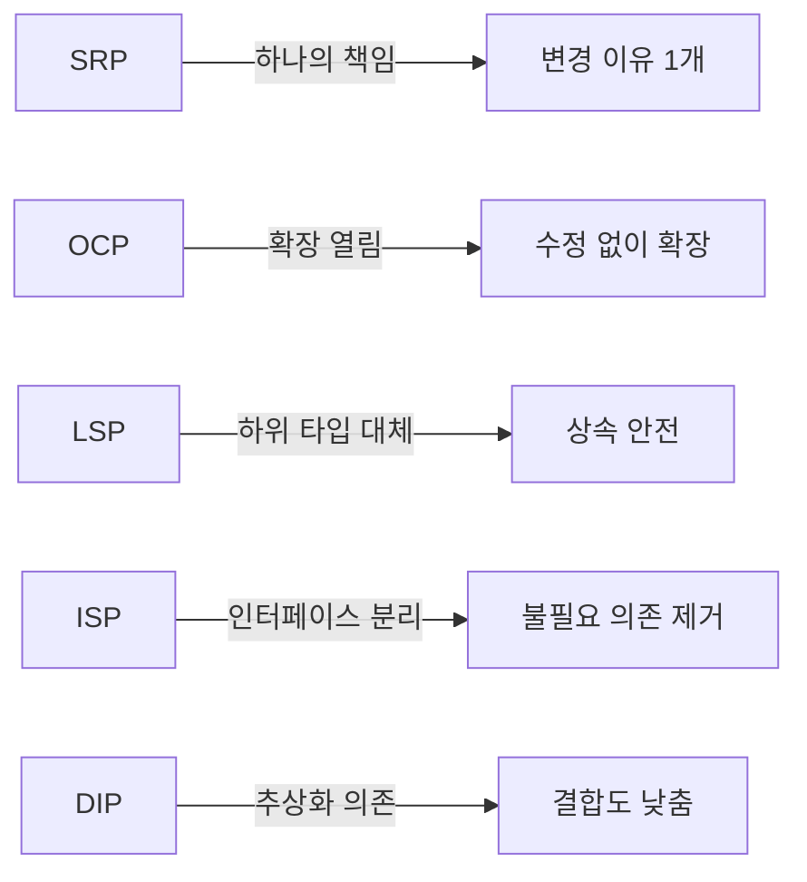

# SOLID 원칙 / SOLID Principles

객체지향 설계의 5가지 핵심 원칙으로, 유지보수 가능하고 확장 가능한 소프트웨어를 만드는 기본 지침입니다.

Five core principles of object-oriented design for building maintainable and scalable software.

## 🌟 선생님의 다정한 설명

### 🎈 초등학생 눈높이

SOLID 원칙은 **좋은 레고 작품을 만드는 5가지 규칙**이라고 생각하면 돼요!

- **S (단일 책임):** 가위는 자르는 것만, 풀은 붙이는 것만! 하나의 도구는 **한 가지 일만** 잘하면 돼요. 가위로 풀칠하려고 하면 이상하잖아요?
- **O (개방-폐쇄):** 레고 집에 2층을 추가할 때, 1층을 **부수지 않고** 위에 쌓으면 돼요!
- **L (리스코프 치환):** 강아지는 동물이니까, "동물이 소리를 낸다"는 규칙을 강아지도 지켜야 해요. 강아지가 소리를 못 내면 이상하죠?
- **I (인터페이스 분리):** 수학 시험에 영어 문제가 나오면 안 되듯, **필요한 것만** 시키자!
- **D (의존성 역전):** 리모컨의 버튼을 누르면 TV든 에어컨이든 작동해요. 리모컨은 **구체적인 제품이 아니라 "작동 방식"에 맞춰져** 있어요.

### 📐 중학생 눈높이

앱을 만들 때 SOLID이 왜 중요한지 볼까요?

**S - 단일 책임 원칙 (SRP):**
`UserManager` 클래스가 로그인, 회원가입, 이메일 발송, 결제까지 다 한다면? 하나를 고치면 다른 게 깨질 수 있어요. 각각 분리하세요!

**O - 개방-폐쇄 원칙 (OCP):**
게임에 새 캐릭터를 추가할 때, 기존 코드를 수정하는 게 아니라 새 클래스를 추가하면 돼요.

**L - 리스코프 치환 원칙 (LSP):**
`Bird` 클래스에 `fly()` 메서드가 있는데, `Penguin`이 `Bird`를 상속받으면? 펭귄은 날 수 없으니 문제가 생겨요!

**I - 인터페이스 분리 원칙 (ISP):**
프린터 인터페이스에 `print()`, `scan()`, `fax()`가 다 있으면, 프린트만 하는 기기도 scan과 fax를 구현해야 해요. 인터페이스를 나누세요!

**D - 의존성 역전 원칙 (DIP):**
알림 기능을 만들 때, `KakaoNotification`에 직접 의존하지 말고 `NotificationService` 인터페이스에 의존하면, 나중에 SMS로 바꿔도 코드 수정이 없어요.

### 🎓 고등학생 눈높이

SOLID은 Robert C. Martin (Uncle Bob)이 정립한 객체지향 설계의 **핵심 원칙**이에요:

- SOLID을 따르면 **결합도(Coupling)는 낮추고 응집도(Cohesion)는 높일** 수 있어요
- 클린 아키텍처, 헥사고날 아키텍처 등 현대 아키텍처 패턴의 이론적 기반이 SOLID이에요
- **면접 단골 질문**: "SOLID 원칙을 실제 프로젝트에 적용한 경험을 말해주세요"
- Spring의 DI(Dependency Injection)가 바로 DIP의 구현체예요
- SOLID을 위반한 코드를 **코드 스멜(Code Smell)**이라고 부르고, 리팩토링의 대상이 돼요
- 소프트웨어 아키텍트, 테크 리드 같은 시니어 직군에서 SOLID 이해도는 필수예요

## 🔍 어떻게 작동하는지 알아볼까요?

SOLID 5가지 원칙이 실제로 어떻게 코드에 적용되는지 살펴볼게요:

**S - Single Responsibility Principle (단일 책임 원칙)**
- 하나의 클래스는 하나의 변경 이유만 가져야 해요
- "이 클래스를 왜 수정해야 하지?"라고 물었을 때 답이 2개 이상이면 SRP 위반!

**O - Open/Closed Principle (개방/폐쇄 원칙)**
- 확장에는 열려 있고, 수정에는 닫혀 있어야 해요
- 새 기능은 기존 코드를 수정하지 않고 추가할 수 있어야 해요

**L - Liskov Substitution Principle (리스코프 치환 원칙)**
- 부모 타입 대신 자식 타입을 넣어도 프로그램이 정상 동작해야 해요
- 상속을 잘못 사용하면 이 원칙을 위반하게 돼요

**I - Interface Segregation Principle (인터페이스 분리 원칙)**
- 클라이언트가 사용하지 않는 메서드에 의존하면 안 돼요
- 큰 인터페이스를 작고 구체적인 인터페이스로 분리하세요

**D - Dependency Inversion Principle (의존성 역전 원칙)**
- 고수준 모듈이 저수준 모듈에 의존하면 안 돼요
- 둘 다 추상화(인터페이스)에 의존해야 해요



## 각 원칙 요약

| 원칙 | 핵심 | 위반 시 문제 |
|------|------|-------------|
| SRP | 하나의 클래스 = 하나의 책임 | God Object 발생 |
| OCP | 기존 코드 수정 없이 확장 | 수정마다 버그 유발 |
| LSP | 자식 클래스가 부모를 대체 | 런타임 오류 |
| ISP | 필요한 인터페이스만 의존 | 불필요한 구현 강제 |
| DIP | 구체가 아닌 추상에 의존 | 높은 결합도 |

```math-anim
type: solid-principles
params:
  principle: { default: 1, min: 1, max: 5, step: 1, label: { kr: "원칙 번호", en: "Principle #" } }
  showViolation: { default: true, label: { kr: "위반 사례", en: "Show Violation" } }
```

### 🌟 선생님의 관찰 노트

- **관찰 내용:** 다이어그램에서 S, O, L, I, D 각각이 하나의 핵심 결과로 연결되어 있는 것이 보이나요? 위반 사례 토글을 켜면 각 원칙을 어겼을 때 어떤 문제가 생기는지도 확인할 수 있어요.
- **관찰 결과:** SOLID 5가지 원칙은 서로 독립적인 것 같지만, 결국 **"변경에 강한 소프트웨어"**라는 하나의 목표를 향해요. SRP로 책임을 분리하고, OCP로 확장성을 확보하고, LSP로 상속 안전성을 보장하고, ISP로 불필요한 의존을 제거하고, DIP로 결합도를 낮추면 — 유지보수하기 좋은 코드가 완성돼요.
- **연결 질문:** "SOLID 원칙을 완벽하게 지키면 코드가 많아지고 복잡해질 수 있어요. 모든 상황에서 SOLID을 엄격하게 적용해야 할까요, 아니면 상황에 따라 유연하게 판단해야 할까요?"

## 🔗 개념 연결 고리

- ➡️ **디자인 패턴** (design-patterns): SOLID을 따르다 보면 자연스럽게 디자인 패턴이 적용돼요
- ➡️ **UML 클래스 다이어그램** (uml-class-diagram): SOLID 적용 전후의 클래스 구조를 시각적으로 비교할 수 있어요
- ➡️ **테스트 전략** (testing-strategy): SOLID을 따른 코드는 단위 테스트를 작성하기 훨씬 쉬워요
- ↔️ **클린 아키텍처**: SOLID이 코드 레벨이라면, 클린 아키텍처는 시스템 레벨의 설계 원칙이에요

## 실생활 활용

- **클린 코드 작성** - Uncle Bob의 "Clean Code" 책에서 강조하는 핵심이 SOLID이에요. 읽기 쉽고, 수정하기 쉽고, 테스트하기 쉬운 코드를 만드는 기본이랍니다.
- **코드 리뷰 체크리스트** - PR 리뷰할 때 "이 클래스가 SRP를 지키고 있나?", "이 변경이 OCP를 위반하지 않나?"를 체크리스트로 활용해요. 팀의 코드 품질을 일정하게 유지하는 데 도움이 돼요.
- **시스템 리팩토링** - 레거시 코드를 개선할 때 SOLID을 기준으로 리팩토링 방향을 정해요. "God Object"를 SRP에 따라 분리하는 것이 대표적인 예시예요.
- **아키텍처 설계** - 마이크로서비스 설계 시 각 서비스의 책임을 SRP로 나누고, 서비스 간 통신은 DIP로 추상화해요.
- **면접 대비** - "SOLID 원칙 중 하나를 골라 실제 적용 사례를 설명해 보세요"는 주니어~시니어 모든 레벨에서 나오는 단골 질문이에요!
