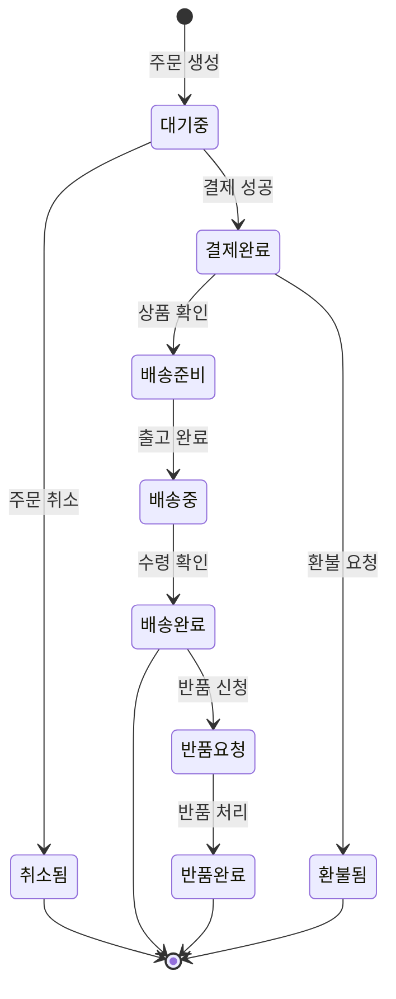

# 상태 다이어그램 / State Diagram

객체의 상태 변화와 그 전이 조건을 표현하는 다이어그램입니다.

A diagram showing the states of an object and the transitions between them.

## 🌟 선생님의 다정한 설명

### 🎈 초등학생 눈높이

여러분, **신호등**을 생각해 봐요! 신호등은 세 가지 **상태**가 있죠:
- 🔴 **빨간불** → (시간이 지나면) → 🟢 **초록불**
- 🟢 **초록불** → (시간이 지나면) → 🟡 **노란불**
- 🟡 **노란불** → (시간이 지나면) → 🔴 **빨간불**

이렇게 **상태가 바뀌는 규칙**을 그림으로 그린 것이 상태 다이어그램이에요!

다른 예도 있어요. 여러분이 **냉장고에서 아이스크림을 꺼내 먹는 과정**:
- **얼어있는 상태** → (꺼내서 기다리면) → **살짝 녹은 상태** → (더 기다리면) → **많이 녹은 상태** → (다 먹으면) → **없는 상태**

어떤 것이 **어떤 조건에서 어떤 상태로 변하는지**를 정리하는 거예요!

### 📐 중학생 눈높이

게임 캐릭터의 상태를 생각해 볼까요?

**캐릭터 상태:**
- **대기 (Idle)** → W키 누름 → **걷기 (Walking)**
- **걷기** → Shift+W → **달리기 (Running)**
- **달리기** → 스태미나 0 → **지침 (Exhausted)**
- **대기/걷기/달리기** → 피격 → **피격 (Hit)**
- **피격** → HP 0 → **사망 (Dead)**
- **피격** → HP > 0 → **대기 (Idle)**

이 모든 상태 변화를 **다이어그램으로 그려놓으면**, 개발할 때 빠뜨리는 상태 없이 완전하게 구현할 수 있어요!

쇼핑몰 앱을 만들 때도 주문 상태(대기 → 결제 → 배송 → 완료)를 상태 다이어그램으로 먼저 그려요.

### 🎓 고등학생 눈높이

상태 다이어그램은 **유한 상태 기계(FSM, Finite State Machine)**를 시각화한 것이에요:

- **컴파일러 설계**: 어휘 분석기(Lexer)가 FSM으로 토큰을 인식해요
- **네트워크 프로토콜**: TCP 연결의 상태 변화(LISTEN → SYN_SENT → ESTABLISHED → CLOSE_WAIT 등)가 상태 다이어그램으로 정의돼요
- **React/Redux**: UI 상태 관리에서 XState 라이브러리가 상태 다이어그램 개념을 직접 구현해요
- **임베디드 시스템**: 자판기, 세탁기, 엘리베이터 등의 제어 로직이 상태 기계로 설계돼요
- **정규 표현식**: 내부적으로 FSM으로 변환되어 문자열 매칭을 수행해요
- 상태 다이어그램을 잘 그리면 **경계 조건(edge case)**을 빠뜨리지 않을 수 있어요

## 🔍 어떻게 작동하는지 알아볼까요?

상태 다이어그램의 구성 요소를 하나씩 살펴볼게요:

**상태 (State)**
- 객체가 특정 시점에 가지는 조건이에요
- 예: 주문의 경우 "대기중", "결제완료", "배송중", "배송완료" 등

**전이 (Transition)**
- 한 상태에서 다른 상태로 바뀌는 것이에요
- 화살표로 표시하고, 화살표 위에 **어떤 조건**으로 바뀌는지 적어요
- 예: "결제 성공" → 대기중에서 결제완료로 전이

**이벤트 (Event)**
- 전이를 일으키는 사건이에요
- 예: "결제 버튼 클릭", "배송 출발", "반품 신청"

**초기 상태와 최종 상태**
- `[*]`로 표시해요
- 시작점(●)에서 출발하고, 종료점(◉)에서 끝나요

**실제 주문 흐름 예시:**
1. 주문 생성 → **대기중**
2. 결제 성공 → **결제완료**
3. 상품 확인 → **배송준비**
4. 출고 → **배송중**
5. 수령 확인 → **배송완료** → 끝!

중간에 "주문 취소", "환불 요청", "반품 신청" 같은 **예외 경로**도 빠짐없이 정의하는 것이 중요해요!



## 주요 구성 요소

- **상태 (State)**: 객체가 취할 수 있는 조건
- **전이 (Transition)**: 상태 간의 변경
- **이벤트 (Event)**: 전이를 유발하는 사건
- **초기 상태 (`[*]`)**: 시작점
- **최종 상태 (`[*]`)**: 종료점

```math-anim
type: state-diagram
params:
  states: { default: 5, min: 3, max: 8, step: 1, label: { kr: "상태 수", en: "States" } }
  showTransitions: { default: true, label: { kr: "전이 표시", en: "Show Transitions" } }
  animate: { default: true, label: { kr: "애니메이션", en: "Animate" } }
```

### 🌟 선생님의 관찰 노트

- **관찰 내용:** 다이어그램에서 `[*]`(초기 상태)에서 시작해 여러 상태를 거쳐 다시 `[*]`(최종 상태)로 끝나는 흐름이 보이나요? 특히 "결제완료"에서 "배송준비"로 가는 정상 경로와 "환불됨"으로 가는 예외 경로가 함께 존재해요. 애니메이션으로 전이 과정을 따라가 보세요.
- **관찰 결과:** 상태 다이어그램은 **모든 가능한 상태와 전이를 빠짐없이** 정의하는 것이 핵심이에요. "결제완료" 상태에서 "환불됨"으로의 전이를 빠뜨리면, 실제 서비스에서 환불 처리를 할 수 없게 돼요! 이처럼 예외 상황을 사전에 파악하는 것이 상태 다이어그램의 가장 큰 가치랍니다.
- **연결 질문:** "배송중인 상품의 주문을 취소하려면 어떻게 해야 할까요? 현재 다이어그램에 그 경로가 있나요? 없다면 어디에 추가해야 할까요?"

## 🔗 개념 연결 고리

- ➡️ **UML 시퀀스 다이어그램** (uml-sequence-diagram): 시퀀스는 "통신의 순서", 상태는 "객체의 변화"를 다뤄요 — 함께 보면 완전한 설계!
- ➡️ **디자인 패턴** (design-patterns): State 패턴은 상태 다이어그램을 코드로 구현하는 디자인 패턴이에요
- ➡️ **테스트 전략** (testing-strategy): 상태 다이어그램의 모든 전이를 테스트 케이스로 만들면 완전한 테스트가 돼요
- ↔️ **유한 상태 기계 (FSM)**: 상태 다이어그램의 이론적 기반, 컴파일러와 정규식의 핵심 원리예요

## 실생활 활용

- **주문 처리 시스템** - 쿠팡, 배달의민족 같은 서비스에서 주문 상태(접수→준비→배달→완료)를 관리해요. 상태 다이어그램으로 설계하면 "배달 중에 취소하면?"같은 예외 상황을 사전에 대비할 수 있어요.
- **게임 캐릭터 AI** - 적 캐릭터가 "순찰→추격→공격→도망" 상태를 오가는 AI를 설계할 때 상태 다이어그램이 필수예요. 유니티의 Animator도 상태 기계 기반이에요!
- **UI 상태 관리 (React 등)** - 버튼의 상태(기본→호버→클릭→비활성), 모달의 상태(닫힘→열림→로딩→완료)를 관리해요. XState 라이브러리가 이 개념을 직접 구현하죠.
- **결제 시스템** - 결제 상태(대기→승인→완료/실패/취소)는 오류 하나가 금전적 손실로 이어져요. 상태 다이어그램으로 완벽히 설계해야 해요.
- **IoT 기기 제어** - 스마트홈 기기(꺼짐→대기→동작→절전)의 상태 전이를 정의하는 데 사용해요!
