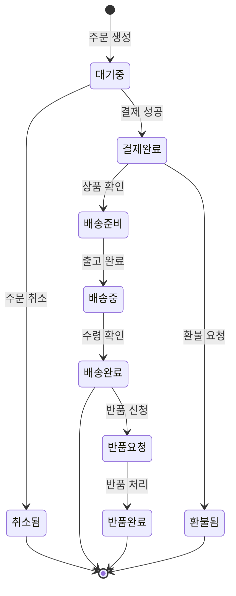

# 상태 다이어그램 / State Diagram

객체의 상태 변화와 그 전이 조건을 표현하는 다이어그램입니다.

A diagram showing the states of an object and the transitions between them.



## 주요 구성 요소

- **상태 (State)**: 객체가 취할 수 있는 조건
- **전이 (Transition)**: 상태 간의 변경
- **이벤트 (Event)**: 전이를 유발하는 사건
- **초기 상태 (`[*]`)**: 시작점
- **최종 상태 (`[*]`)**: 종료점

```math-anim
type: state-diagram
params:
  states: { default: 5, min: 3, max: 8, step: 1, label: { kr: "상태 수", en: "States" } }
  showTransitions: { default: true, label: { kr: "전이 표시", en: "Show Transitions" } }
  animate: { default: true, label: { kr: "애니메이션", en: "Animate" } }
```

## 실생활 활용

- **주문 처리 시스템**
- **게임 캐릭터 AI**
- **UI 상태 관리 (React 등)**
