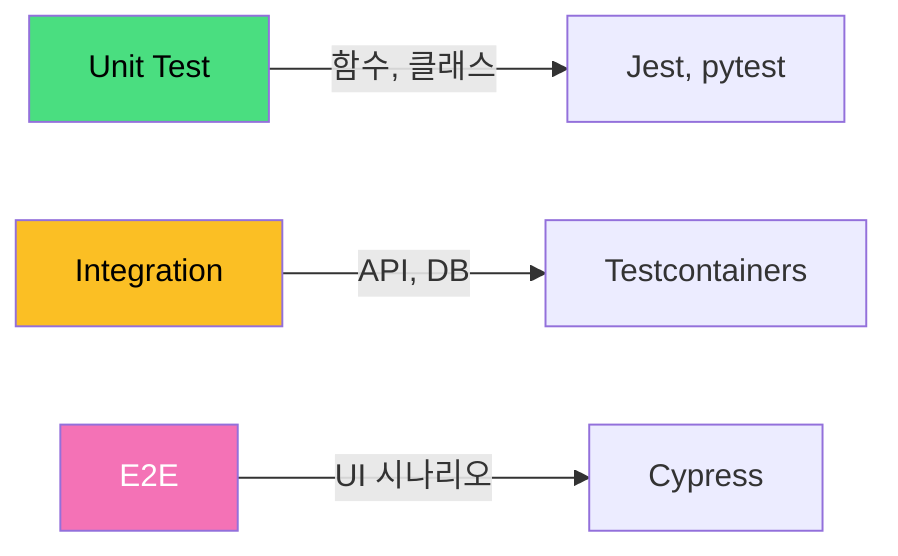

# 테스트 전략 / Testing Strategy

소프트웨어 품질을 보장하기 위한 체계적인 테스트 계층과 방법론입니다.

A systematic approach to ensuring software quality through layered testing methodologies.

## 🌟 선생님의 다정한 설명

### 🎈 초등학생 눈높이

여러분, 과학 시간에 실험하기 전에 **예상 결과**를 적어본 적 있나요? 테스트 전략은 그것과 비슷해요!

케이크를 만들 때를 생각해 봐요:
- 🧪 **재료 하나하나 확인** (단위 테스트) - "밀가루가 상하지 않았나? 계란은 신선한가?"
- 🔗 **재료를 섞어서 확인** (통합 테스트) - "반죽이 잘 섞였나? 맛이 이상하진 않나?"
- 🎂 **완성된 케이크 확인** (E2E 테스트) - "케이크가 예쁜가? 맛있는가? 손님에게 내놔도 되는가?"

마치 피라미드처럼 생겼어요! 아래에는 작고 빠른 검사가 아주 많고, 위로 갈수록 크고 느린 검사가 적어요.

작은 확인을 많이 하면, 큰 문제가 생기기 전에 **미리 잡을 수 있어요**. "예방이 치료보다 낫다"는 말처럼요!

### 📐 중학생 눈높이

여러분이 **계산기 앱**을 만들었다고 해 봐요. 어떻게 테스트할까요?

**단위 테스트 (Unit Test):**
- `add(2, 3)` → 5가 나오는지?
- `divide(10, 0)` → 에러가 제대로 뜨는지?
- 함수 하나하나를 개별적으로 확인해요

**통합 테스트 (Integration Test):**
- 사용자가 "2 + 3 ="을 입력하면 화면에 5가 표시되는지?
- 계산 결과가 히스토리에 저장되는지?
- 여러 부품이 함께 잘 동작하는지 확인해요

**E2E 테스트 (End-to-End Test):**
- 실제 사용자처럼 앱을 열고 → 숫자 입력 → 계산 → 결과 확인
- 전체 흐름이 자연스러운지 확인해요

이 세 가지를 **피라미드 형태**로 구성해요: 단위 테스트를 가장 많이, E2E 테스트를 가장 적게!

### 🎓 고등학생 눈높이

테스트 전략은 소프트웨어의 **신뢰성**을 보장하는 핵심이에요:

- **테스트 피라미드**: Google이 제안한 비율은 Unit(70%) : Integration(20%) : E2E(10%)
- **TDD (Test-Driven Development):** 테스트를 먼저 작성하고 코드를 나중에 작성하는 방법론. Red → Green → Refactor 사이클로 진행해요
- **코드 커버리지:** 전체 코드 중 테스트가 실행하는 코드의 비율. 보통 80% 이상을 목표로 해요
- **QA 엔지니어, SDET(Software Development Engineer in Test)** 같은 전문 테스트 직군이 있어요
- **회귀 테스트:** 새 기능을 추가했을 때 기존 기능이 깨지지 않았는지 확인하는 것
- 현업에서 테스트 코드 작성 능력은 시니어 개발자의 필수 역량으로 여겨져요

## 🔍 어떻게 작동하는지 알아볼까요?

테스트 전략이 실제로 어떻게 적용되는지 살펴볼게요:

**테스트 피라미드의 각 층:**

**1층 (가장 넓은 바닥): 단위 테스트**
- 함수, 메서드 하나하나를 독립적으로 테스트해요
- 실행 속도가 매우 빨라요 (밀리초 단위)
- 외부 의존성은 Mock(가짜 객체)으로 대체해요
- 도구: Jest, pytest, JUnit 등

**2층 (중간): 통합 테스트**
- 여러 모듈이 함께 동작하는지 테스트해요
- 실제 데이터베이스, API 등과 연동해서 확인해요
- 도구: Testcontainers, Supertest 등

**3층 (가장 좁은 꼭대기): E2E 테스트**
- 사용자 시나리오 전체를 테스트해요
- 실제 브라우저를 띄워서 클릭, 입력, 확인을 자동으로 수행해요
- 도구: Cypress, Playwright, Selenium 등

**추가: 특수 테스트**
- **성능 테스트:** 시스템이 높은 부하를 견딜 수 있는지 (k6, JMeter)
- **보안 테스트:** 취약점은 없는지 (OWASP ZAP)
- **접근성 테스트:** 모든 사용자가 이용 가능한지 (axe-core)



## 테스트 유형

| 유형 | 범위 | 속도 | 비용 |
|------|------|------|------|
| 단위 테스트 | 함수/메서드 | 매우 빠름 | 낮음 |
| 통합 테스트 | 모듈 간 연동 | 보통 | 중간 |
| E2E 테스트 | 전체 시스템 | 느림 | 높음 |
| 성능 테스트 | 부하/스트레스 | 느림 | 높음 |

```math-anim
type: testing-strategy
params:
  unitTests: { default: 80, min: 0, max: 100, step: 5, label: { kr: "단위 테스트 (%)", en: "Unit Tests (%)" } }
  integrationTests: { default: 15, min: 0, max: 100, step: 5, label: { kr: "통합 테스트 (%)", en: "Integration Tests (%)" } }
  e2eTests: { default: 5, min: 0, max: 100, step: 5, label: { kr: "E2E 테스트 (%)", en: "E2E Tests (%)" } }
  showPyramid: { default: true, label: { kr: "피라미드 보기", en: "Show Pyramid" } }
```

### 🌟 선생님의 관찰 노트

- **관찰 내용:** 다이어그램에서 Unit Test가 초록색으로 가장 크고, E2E가 분홍색으로 가장 작게 표현된 것이 보이나요? 피라미드 슬라이더를 조절하면 각 테스트 유형의 비율이 어떻게 변하는지 관찰할 수 있어요.
- **관찰 결과:** 테스트 피라미드의 핵심은 **빠르고 저렴한 테스트를 많이, 느리고 비싼 테스트를 적게** 하는 거예요. 단위 테스트 비율을 낮추고 E2E 비율을 높이면 테스트 실행 시간이 급격히 늘어나고, 실패 원인을 찾기도 어려워져요. 이것을 "아이스크림 콘 안티패턴"이라고 부른답니다.
- **연결 질문:** "테스트가 100% 통과한다고 해서 버그가 없다고 확신할 수 있을까요? 테스트 커버리지 100%와 소프트웨어 품질 100%는 같은 의미일까요?"

## 🔗 개념 연결 고리

- ➡️ **CI/CD 파이프라인** (cicd-pipeline): 테스트는 CI/CD 파이프라인의 핵심 단계예요
- ➡️ **SDLC** (sdlc): 테스트는 SDLC의 품질 보증 단계에 해당해요
- ➡️ **디자인 패턴** (design-patterns): 테스트하기 좋은 코드를 작성하려면 디자인 패턴 지식이 필요해요
- ➡️ **SOLID 원칙** (solid-principles): SOLID을 따르면 테스트하기 쉬운 코드가 만들어져요

## 실생활 활용

- **TDD (테스트 주도 개발)** - 테스트를 먼저 작성하고 코드를 나중에 작성하는 방법이에요. 처음엔 어색하지만 익숙해지면 버그가 확 줄어들고, 코드 설계도 깔끔해져요. 많은 시니어 개발자들이 TDD를 실천하고 있답니다.
- **코드 커버리지 측정** - SonarQube, Codecov 같은 도구로 테스트가 코드의 몇 퍼센트를 커버하는지 측정해요. PR에 커버리지가 떨어지면 자동으로 경고해주는 설정도 가능해요.
- **회귀 테스트 자동화** - 새 기능을 추가할 때마다 기존 기능이 깨지지 않았는지 자동으로 확인해요. 이것이 없으면 "하나 고치면 둘이 깨지는" 악순환에 빠져요.
- **A/B 테스트** - 두 가지 버전을 동시에 배포하고 어떤 것이 더 효과적인지 데이터로 검증해요. UI/UX 개선에 많이 사용돼요.
- **부하 테스트** - 블랙프라이데이, 수강신청처럼 트래픽이 폭주하는 상황을 미리 시뮬레이션해서 서버가 버틸 수 있는지 확인해요!
