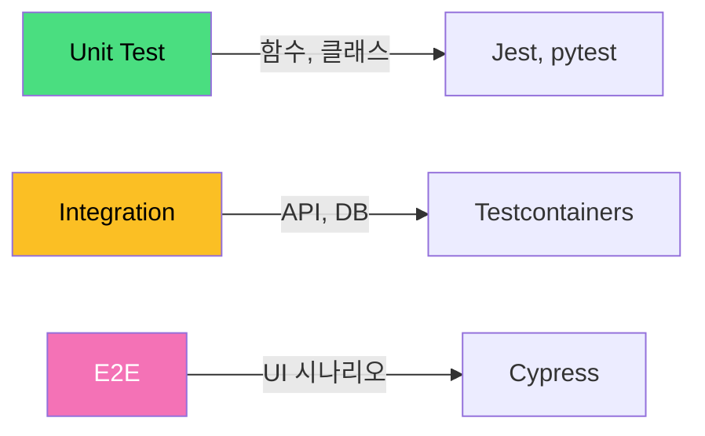

# 테스트 전략 / Testing Strategy

소프트웨어 품질을 보장하기 위한 체계적인 테스트 계층과 방법론입니다.

A systematic approach to ensuring software quality through layered testing methodologies.



## 테스트 유형

| 유형 | 범위 | 속도 | 비용 |
|------|------|------|------|
| 단위 테스트 | 함수/메서드 | 매우 빠름 | 낮음 |
| 통합 테스트 | 모듈 간 연동 | 보통 | 중간 |
| E2E 테스트 | 전체 시스템 | 느림 | 높음 |
| 성능 테스트 | 부하/스트레스 | 느림 | 높음 |

```math-anim
type: testing-strategy
params:
  unitTests: { default: 80, min: 0, max: 100, step: 5, label: { kr: "단위 테스트 (%)", en: "Unit Tests (%)" } }
  integrationTests: { default: 15, min: 0, max: 100, step: 5, label: { kr: "통합 테스트 (%)", en: "Integration Tests (%)" } }
  e2eTests: { default: 5, min: 0, max: 100, step: 5, label: { kr: "E2E 테스트 (%)", en: "E2E Tests (%)" } }
  showPyramid: { default: true, label: { kr: "피라미드 보기", en: "Show Pyramid" } }
```

## 실생활 활용

- **TDD (테스트 주도 개발)**
- **코드 커버리지 측정**
- **회귀 테스트 자동화**
