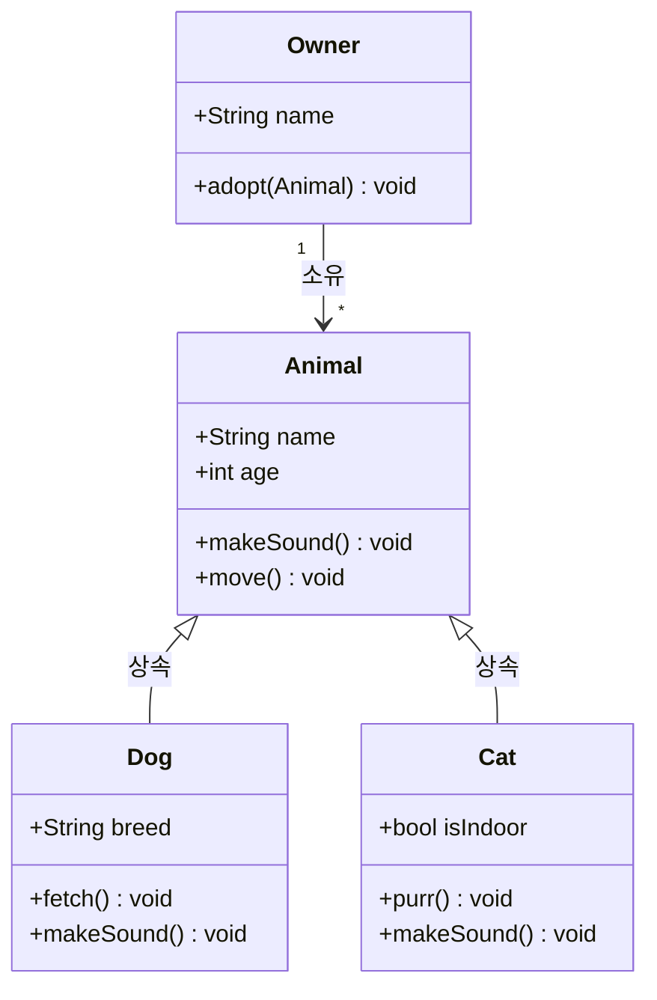

# UML 클래스 다이어그램 / UML Class Diagram

시스템의 클래스, 속성, 메서드, 클래스 간의 관계를 시각적으로 표현하는 정적 구조 다이어그램입니다.

A static structure diagram showing classes, their attributes, methods, and relationships.

## 🌟 선생님의 다정한 설명

### 🎈 초등학생 눈높이

여러분, **동물 도감**을 만들어 본 적 있나요? UML 클래스 다이어그램은 프로그래밍의 동물 도감이에요!

동물 카드를 만든다고 생각해 봐요:
- 📋 **동물 카드**: 이름, 나이, 소리내기(), 움직이기()
- 🐕 **강아지 카드**: 품종, 물어오기(), 소리내기()="멍멍!"
- 🐈 **고양이 카드**: 실내/실외, 골골대기(), 소리내기()="야옹!"

강아지와 고양이는 **동물의 한 종류**이니까 동물 카드의 특징을 물려받아요(상속). 그리고 **주인** 카드가 있어서 "주인 한 명이 여러 동물을 키운다"는 관계도 표현해요.

이렇게 **누가 어떤 특징을 가지고 있고, 서로 어떤 관계인지**를 그림으로 그린 것이 클래스 다이어그램이에요!

### 📐 중학생 눈높이

RPG 게임의 캐릭터 시스템을 설계한다고 생각해 봐요:

- **Character(캐릭터)** 클래스: name, hp, mp, attack(), defend()
- **Warrior(전사)**: armor, shieldBlock() — Character를 상속
- **Mage(마법사)**: mana, castSpell() — Character를 상속
- **Inventory(인벤토리)**: 캐릭터가 소유 (1:1 관계)
- **Item(아이템)**: 인벤토리에 들어있는 것 (1:N 관계)

클래스 다이어그램은 이런 **설계도를 코딩하기 전에 그리는 것**이에요. 건축가가 건물을 짓기 전에 설계도를 그리듯이, 개발자도 코드를 작성하기 전에 클래스 다이어그램을 그려요.

화살표의 종류로 관계를 구분해요:
- 실선 + 삼각형 = 상속 (Warrior **는** Character)
- 실선 + 화살표 = 사용 (Owner **는** Animal을 소유)

### 🎓 고등학생 눈높이

UML(Unified Modeling Language)은 **소프트웨어 설계의 국제 표준 언어**예요:

- 1997년 OMG(Object Management Group)에서 표준화했어요
- 클래스 다이어그램은 UML의 **14가지 다이어그램 중 가장 많이 사용**되는 것이에요
- **소프트웨어 아키텍트**가 시스템 구조를 설계할 때 필수적으로 사용해요
- IntelliJ, Visual Studio 등의 IDE에서 코드로부터 클래스 다이어그램을 자동 생성할 수도 있어요
- **도메인 주도 설계(DDD)**에서 도메인 모델을 표현할 때 핵심적으로 사용돼요
- 실무 문서, 기술 면접, 학술 논문 어디서든 통용되는 공통 언어예요

## 🔍 어떻게 작동하는지 알아볼까요?

클래스 다이어그램의 구성 요소를 하나씩 살펴볼게요:

**클래스 표기법:**
하나의 클래스는 3개의 칸으로 나뉘어요:
- **1칸 (맨 위):** 클래스 이름 (예: `Animal`)
- **2칸 (중간):** 속성 (예: `+String name`, `+int age`)
- **3칸 (맨 아래):** 메서드 (예: `+makeSound() void`)

접근 제어자도 표시해요:
- `+` = public (누구나 접근 가능)
- `-` = private (자기만 접근 가능)
- `#` = protected (자신과 자식만 접근 가능)

**관계 유형:**
- **상속:** "강아지 **는** 동물이다" — 실선 + 빈 삼각형 화살표
- **구현:** "날 수 있는 것 **을** 구현한다" — 점선 + 빈 삼각형 화살표
- **연관:** "주인 **이** 동물을 소유한다" — 실선 + 화살표
- **집합:** "자동차 **에** 타이어가 포함된다" (분리 가능) — 빈 마름모
- **합성:** "집 **에** 방이 포함된다" (분리 불가) — 채운 마름모

**다중성 표기:** `"1" --> "*"` 는 "1대 다(多)" 관계를 의미해요.



## 관계 유형

- **상속 (Inheritance)**: 부모-자식 관계 (`──▷`)
- **구현 (Implementation)**: 인터페이스 구현 (`──▷` 점선)
- **연관 (Association)**: 클래스 간 사용 관계 (`──>`)
- **집합 (Aggregation)**: 전체-부분 관계 (`◇──>`)
- **합성 (Composition)**: 강한 소유 관계 (`◆──>`)

```math-anim
type: uml-class-diagram
params:
  classes: { default: 4, min: 2, max: 8, step: 1, label: { kr: "클래스 수", en: "Classes" } }
  showRelations: { default: true, label: { kr: "관계 표시", en: "Show Relations" } }
```

### 🌟 선생님의 관찰 노트

- **관찰 내용:** 다이어그램에서 Animal 클래스 아래에 Dog과 Cat이 "상속" 관계로 연결되어 있고, Owner가 Animal을 "소유" 관계로 가리키고 있는 것이 보이나요? `"1" --> "*"`는 한 명의 주인이 여러 마리의 동물을 소유할 수 있다는 뜻이에요.
- **관찰 결과:** 클래스 다이어그램은 **코드의 설계도**예요. 이 다이어그램 하나만 보면 어떤 클래스가 있고, 어떤 속성과 메서드를 가지며, 서로 어떤 관계인지 한눈에 파악할 수 있어요. 좋은 클래스 다이어그램은 코드를 읽지 않아도 시스템 구조를 이해할 수 있게 해준답니다.
- **연결 질문:** "Dog과 Cat 모두 makeSound()를 가지고 있는데, 각각 다른 소리를 내야 해요. 이런 것을 '다형성(Polymorphism)'이라고 하는데, 왜 이것이 중요할까요?"

## 🔗 개념 연결 고리

- ➡️ **디자인 패턴** (design-patterns): 디자인 패턴의 구조를 클래스 다이어그램으로 표현해요
- ➡️ **SOLID 원칙** (solid-principles): SOLID을 적용한 설계를 클래스 다이어그램으로 검증할 수 있어요
- ➡️ **UML 시퀀스 다이어그램** (uml-sequence-diagram): 클래스의 정적 구조(클래스) + 동적 행위(시퀀스)를 함께 봐야 완전한 설계예요
- ➡️ **ER 다이어그램** (er-diagram): 클래스 다이어그램의 관계 표기법과 유사하지만, 데이터베이스에 특화되어 있어요

## 실생활 활용

- **객체지향 설계 문서화** - 새 프로젝트를 시작할 때 팀원들이 함께 클래스 다이어그램을 그리면서 설계를 논의해요. 코드 작성 전에 구조를 합의하면 나중에 충돌을 줄일 수 있어요.
- **데이터베이스 ERD 설계** - 클래스 다이어그램의 관계가 그대로 데이터베이스 테이블 관계로 이어져요. ORM(Object-Relational Mapping)이 이 둘을 자동으로 연결해 주죠.
- **API 인터페이스 설계** - REST API나 GraphQL의 타입 시스템을 설계할 때 클래스 다이어그램으로 데이터 모델을 먼저 그려요.
- **리팩토링 계획** - 레거시 코드의 현재 구조를 다이어그램으로 그리고, 목표 구조를 다시 그려서 리팩토링 방향을 정해요.
- **기술 문서 작성** - 오픈소스 라이브러리나 프레임워크의 아키텍처 문서에 클래스 다이어그램이 필수적으로 들어가요!
