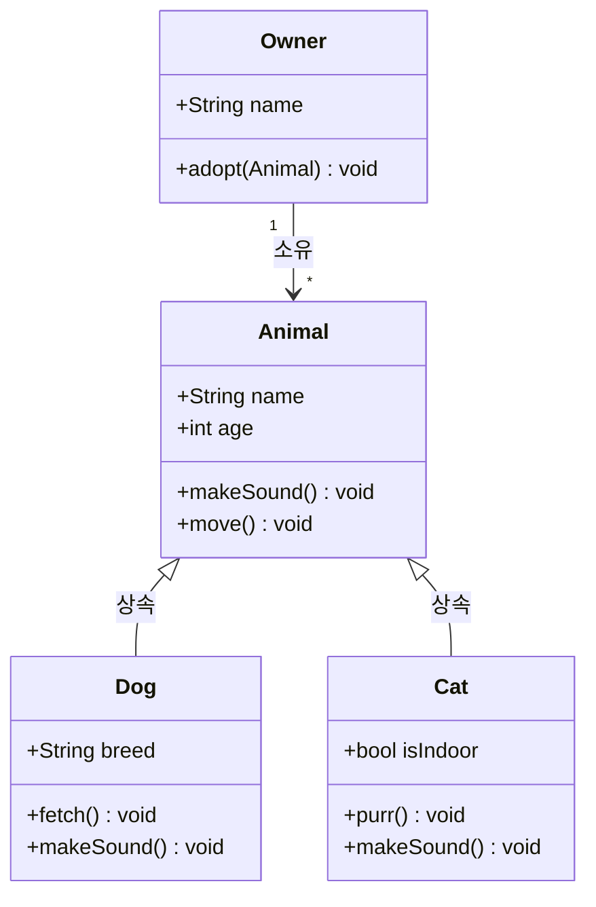

# UML 클래스 다이어그램 / UML Class Diagram

시스템의 클래스, 속성, 메서드, 클래스 간의 관계를 시각적으로 표현하는 정적 구조 다이어그램입니다.

A static structure diagram showing classes, their attributes, methods, and relationships.



## 관계 유형

- **상속 (Inheritance)**: 부모-자식 관계 (`──▷`)
- **구현 (Implementation)**: 인터페이스 구현 (`──▷` 점선)
- **연관 (Association)**: 클래스 간 사용 관계 (`──>`)
- **집합 (Aggregation)**: 전체-부분 관계 (`◇──>`)
- **합성 (Composition)**: 강한 소유 관계 (`◆──>`)

```math-anim
type: uml-class-diagram
params:
  classes: { default: 4, min: 2, max: 8, step: 1, label: { kr: "클래스 수", en: "Classes" } }
  showRelations: { default: true, label: { kr: "관계 표시", en: "Show Relations" } }
```

## 실생활 활용

- **객체지향 설계 문서화**
- **데이터베이스 ERD 설계**
- **API 인터페이스 설계**
