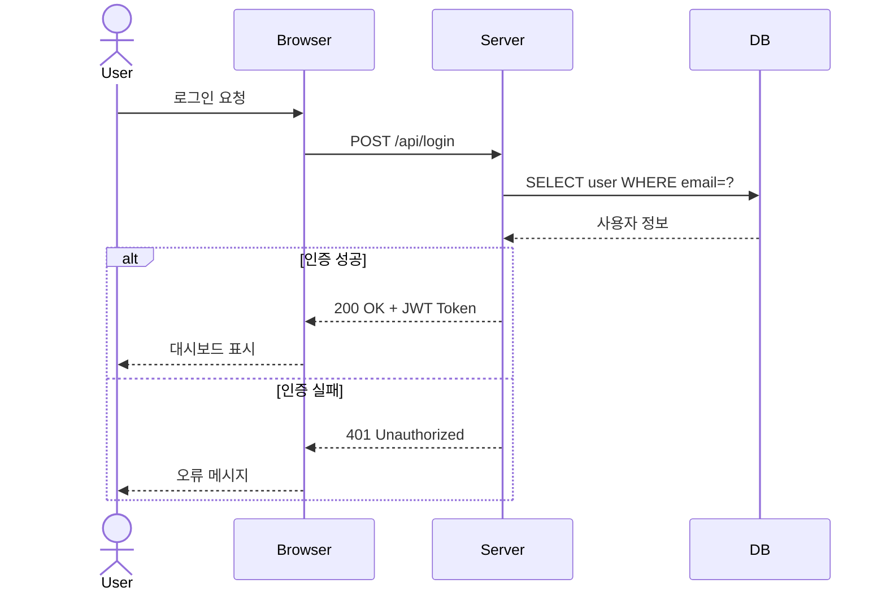

# UML 시퀀스 다이어그램 / UML Sequence Diagram

객체 간의 상호작용을 시간 순서에 따라 표현하는 동적 다이어그램입니다.

A dynamic diagram showing object interactions arranged in time sequence.



## 주요 요소

- **액터 (Actor)**: 시스템 외부의 사용자
- **생명선 (Lifeline)**: 객체의 존재 기간
- **메시지 (Message)**: 동기(`->>`) / 비동기(`-->>`) 호출
- **alt/opt/loop**: 조건 분기 및 반복

```math-anim
type: uml-sequence-diagram
params:
  actors: { default: 4, min: 2, max: 6, step: 1, label: { kr: "참여자 수", en: "Participants" } }
  messages: { default: 6, min: 3, max: 10, step: 1, label: { kr: "메시지 수", en: "Messages" } }
  animate: { default: true, label: { kr: "애니메이션", en: "Animate" } }
```

## 실생활 활용

- **API 설계 문서**
- **시스템 간 통신 분석**
- **비즈니스 프로세스 모델링**
