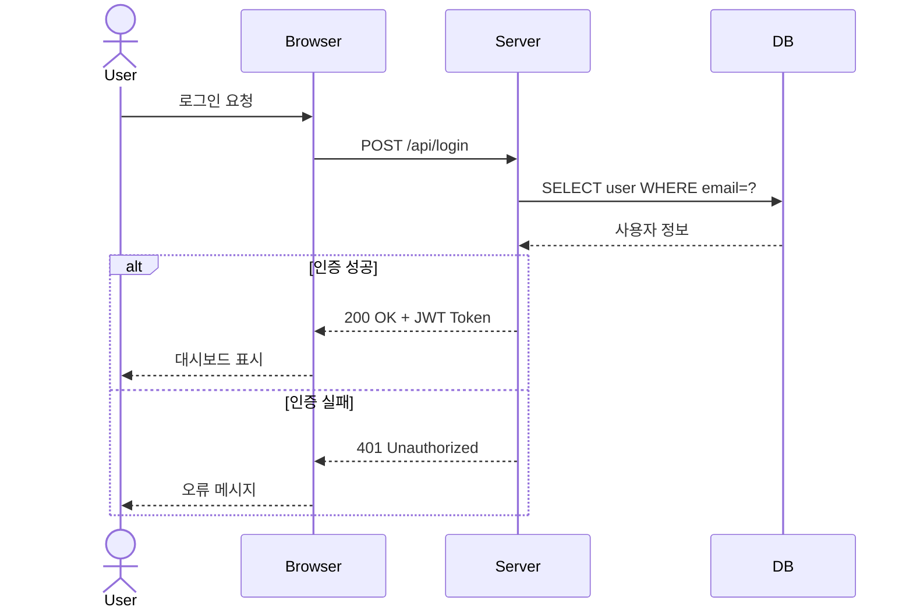

# UML 시퀀스 다이어그램 / UML Sequence Diagram

객체 간의 상호작용을 시간 순서에 따라 표현하는 동적 다이어그램입니다.

A dynamic diagram showing object interactions arranged in time sequence.

## 🌟 선생님의 다정한 설명

### 🎈 초등학생 눈높이

여러분, **전화 놀이**를 해본 적 있나요? 시퀀스 다이어그램은 "누가 누구에게 무슨 말을 했는지"를 **시간 순서대로** 적어놓은 대본이에요!

학교 도서관에서 책을 빌리는 과정을 생각해 봐요:
1. 👧 **나** → 📚 **도서관 선생님**: "이 책 빌려도 되나요?"
2. 📚 **도서관 선생님** → 💻 **컴퓨터**: "이 학생이 빌린 책이 몇 권인지 확인해 줘"
3. 💻 **컴퓨터** → 📚 **도서관 선생님**: "2권 빌렸어요, 3권 더 빌릴 수 있어요!"
4. 📚 **도서관 선생님** → 👧 **나**: "네, 빌려줄게요!"

이렇게 **대화의 순서**를 위에서 아래로 적어놓은 것이 시퀀스 다이어그램이에요. 연극 대본처럼 누가 먼저 말하고, 누가 대답하는지 한눈에 볼 수 있죠!

### 📐 중학생 눈높이

여러분이 **채팅 앱**을 만든다고 해 봐요. 메시지를 보내는 과정을 시퀀스 다이어그램으로 그려볼게요:

1. **사용자** → **앱 화면**: "보내기" 버튼 클릭
2. **앱 화면** → **서버**: 메시지 데이터 전송 (POST /api/message)
3. **서버** → **데이터베이스**: 메시지 저장
4. **데이터베이스** → **서버**: "저장 완료!"
5. **서버** → **상대방 앱**: 푸시 알림 전송
6. **서버** → **앱 화면**: "전송 완료" 응답
7. **앱 화면** → **사용자**: 체크 표시 ✓ 보여주기

이런 흐름을 **코딩하기 전에** 다이어그램으로 그려놓으면, 어떤 순서로 무엇을 구현해야 하는지 명확해져요! 마치 게임 공략 순서도를 그리는 것처럼요.

### 🎓 고등학생 눈높이

시퀀스 다이어그램은 **시스템 설계의 핵심 도구**예요:

- **API 설계 문서**에 가장 많이 사용되는 UML 다이어그램이에요
- 마이크로서비스 간의 통신 흐름을 파악할 때 필수적이에요
- **동기(Synchronous) vs 비동기(Asynchronous)** 호출의 차이를 명확히 표현할 수 있어요
- **alt(조건 분기), loop(반복), opt(선택적 실행)** 등의 프레임으로 복잡한 로직도 표현 가능해요
- 실무에서 PlantUML, Mermaid 등의 도구로 코드처럼 다이어그램을 작성하는 **Diagram as Code** 방식이 트렌드예요
- 기술 면접에서 "이 시스템의 로그인 흐름을 시퀀스 다이어그램으로 그려보세요"라는 질문이 나올 수 있어요

## 🔍 어떻게 작동하는지 알아볼까요?

시퀀스 다이어그램의 구성 요소를 하나씩 살펴볼게요:

**참여자 (Participants)**
- 다이어그램의 맨 위에 나열돼요
- **액터 (Actor):** 시스템 외부의 사용자 (막대 사람 아이콘)
- **객체 (Object):** Browser, Server, DB 등 시스템 구성 요소

**생명선 (Lifeline)**
- 각 참여자 아래로 내려가는 점선이에요
- 위에서 아래로 갈수록 **시간이 흘러가는** 것을 의미해요

**메시지 (Messages)**
- **실선 화살표 (`->>`):** 동기 호출 (응답을 기다림)
- **점선 화살표 (`-->>`):** 응답 메시지
- **비동기:** 응답을 기다리지 않고 다음 작업 진행

**프레임 (Frames)**
- **alt:** if-else 같은 조건 분기
- **loop:** 반복문
- **opt:** 선택적 실행 (조건이 참일 때만)

예시 다이어그램의 로그인 흐름에서 `alt` 프레임을 보면, 인증 성공/실패에 따라 다른 경로를 타는 것을 명확히 볼 수 있어요!



## 주요 요소

- **액터 (Actor)**: 시스템 외부의 사용자
- **생명선 (Lifeline)**: 객체의 존재 기간
- **메시지 (Message)**: 동기(`->>`) / 비동기(`-->>`) 호출
- **alt/opt/loop**: 조건 분기 및 반복

```math-anim
type: uml-sequence-diagram
params:
  actors: { default: 4, min: 2, max: 6, step: 1, label: { kr: "참여자 수", en: "Participants" } }
  messages: { default: 6, min: 3, max: 10, step: 1, label: { kr: "메시지 수", en: "Messages" } }
  animate: { default: true, label: { kr: "애니메이션", en: "Animate" } }
```

### 🌟 선생님의 관찰 노트

- **관찰 내용:** 다이어그램에서 User → Browser → Server → DB로 요청이 전달되고, 다시 DB → Server → Browser → User로 응답이 돌아오는 흐름이 보이나요? 그리고 `alt` 프레임 안에 "인증 성공"과 "인증 실패" 두 가지 경로가 나뉘어 있어요. 애니메이션을 켜면 메시지가 시간 순서대로 흘러가는 것을 볼 수 있어요.
- **관찰 결과:** 시퀀스 다이어그램은 **시간의 흐름에 따른 통신 과정**을 보여줘요. 특히 요청(실선)과 응답(점선)이 쌍을 이루는 것에 주목하세요. 매 요청에는 반드시 응답이 따라야 해요. 이것이 깨지면 시스템에 문제가 생겨요 (예: 타임아웃, 데드락).
- **연결 질문:** "로그인 과정에서 DB 응답이 5초 이상 걸린다면? 사용자는 계속 기다려야 할까요? 이런 상황을 어떻게 처리할 수 있을까요?"

## 🔗 개념 연결 고리

- ➡️ **UML 클래스 다이어그램** (uml-class-diagram): 클래스(정적 구조) + 시퀀스(동적 행위)를 함께 봐야 완전한 설계예요
- ➡️ **디자인 패턴** (design-patterns): Observer, Command 등 행위 패턴의 동작을 시퀀스 다이어그램으로 표현해요
- ➡️ **마이크로서비스 아키텍처** (microservices-architecture): 서비스 간 통신 흐름을 분석할 때 필수예요
- ➡️ **상태 다이어그램** (state-diagram): 시퀀스가 "통신의 순서"라면, 상태는 "객체의 상태 변화"를 다뤄요

## 실생활 활용

- **API 설계 문서** - REST API나 gRPC의 호출 흐름을 시퀀스 다이어그램으로 문서화하면, 프론트엔드와 백엔드 개발자가 같은 이해를 공유할 수 있어요. Swagger 문서와 함께 사용하면 효과적이에요!
- **시스템 간 통신 분석** - 장애가 발생했을 때 "어디서 어디로 가는 요청이 실패했는지"를 시퀀스 다이어그램으로 추적하면 원인을 빠르게 찾을 수 있어요.
- **비즈니스 프로세스 모델링** - "고객이 주문하면 어떤 시스템이 어떤 순서로 동작하는가?"를 비개발자도 이해할 수 있는 형태로 표현해요.
- **결제 시스템 설계** - PG(결제 대행사)와의 통신, 주문-결제-배송 흐름을 시퀀스 다이어그램으로 설계하면 누락되는 단계 없이 구현할 수 있어요.
- **채팅/실시간 시스템** - WebSocket 통신, 푸시 알림 등 비동기 메시지 흐름을 시각화하는 데 특히 유용해요!
