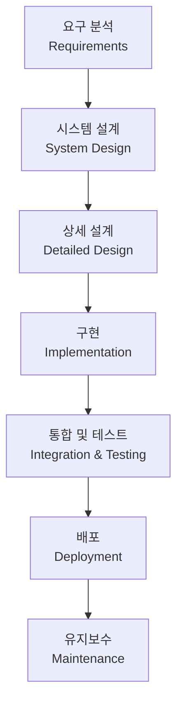

# 폭포수 모델 / Waterfall Model

각 단계를 순차적으로 완료한 후 다음 단계로 넘어가는 전통적인 소프트웨어 개발 방법론입니다.

A traditional sequential approach where each phase must be completed before the next begins.

## 🌟 선생님의 다정한 설명

### 🎈 초등학생 눈높이

폭포수 모델은 이름 그대로 **폭포처럼 위에서 아래로 흘러가는** 방법이에요! 마치 미끄럼틀을 타는 것과 비슷해요 — 한 번 내려가면 다시 올라가기 어렵죠.

학교에서 **발표 준비**를 할 때를 생각해 봐요:
1. **주제 정하기** — 무엇에 대해 발표할지 결정 (다 정하면 다음으로!)
2. **자료 조사하기** — 책이나 인터넷에서 정보 모으기
3. **발표자료 만들기** — PPT나 포스터 제작
4. **연습하기** — 발표 연습
5. **발표하기** — 드디어 친구들 앞에서!
6. **피드백 받기** — 선생님 평가

각 단계가 **완전히 끝나야** 다음 단계로 넘어가는 거예요. PPT를 만들다가 "아, 주제를 바꾸고 싶어!"라고 하면 처음부터 다시 해야 하는 것처럼요.

### 📐 중학생 눈높이

게임을 만든다고 상상해 볼까요? 폭포수 모델로 게임을 만들면 이런 식이에요:

1. **기획 문서 완성** → "RPG 게임, 스토리 10챕터, 캐릭터 20종"
2. **설계 완료** → 게임 엔진 선택, UI 디자인 확정
3. **개발 완료** → 모든 코드 작성 끝
4. **테스트 완료** → 버그 전부 수정
5. **출시!**

문제가 뭔지 보이나요? 3단계에서 코딩하다가 "이 기획은 재미없겠는데..."라고 느껴도, 1단계로 돌아가기가 정말 어려워요. 이미 설계도 다 했고 코드도 짰으니까요.

그래서 **요구사항이 처음부터 명확한 프로젝트**에 적합해요. 마치 건축에서 설계도 확정 후 건물을 짓는 것처럼요.

### 🎓 고등학생 눈높이

폭포수 모델은 1970년 Winston Royce가 소개한 **최초의 체계적 소프트웨어 개발 방법론**이에요.

현업에서의 실제 상황:
- **국방/항공/의료** 분야에서는 여전히 폭포수 모델이 많이 사용됩니다. 요구사항이 변하면 안 되는 미션 크리티컬 시스템이니까요
- **SI(시스템 통합) 기업**에서는 계약서에 SDLC 각 단계별 산출물을 명시하기 때문에 폭포수 모델이 관리에 유리해요
- **변경 비용 곡선**: 요구 분석에서 1달러로 고칠 수 있는 것이 유지보수 단계에서는 100달러가 들 수 있어요
- 소프트웨어 공학을 전공하면 폭포수 모델의 한계를 극복한 **V-Model**, **스파이럴 모델** 등도 배우게 됩니다

## 🔍 어떻게 작동하는지 알아볼까요?

폭포수 모델의 작동 원리를 단계별로 따라가 볼게요:

**1단계: 요구 분석 (Requirements)**
- 고객과 여러 차례 미팅을 하고, 요구사항 명세서(SRS)를 작성해요
- 이 문서가 **확정**되어야 다음으로 넘어갈 수 있어요

**2단계: 시스템 설계 (System Design)**
- 요구사항을 기반으로 전체 시스템 구조를 설계해요
- 아키텍처 문서, 기술 스택 선정 등이 이루어져요

**3단계: 상세 설계 (Detailed Design)**
- 각 모듈별 세부 설계를 진행해요
- 데이터베이스 스키마, API 명세, 클래스 설계 등을 확정해요

**4단계: 구현 (Implementation)**
- 설계 문서를 보고 코드를 작성해요
- 개발자들이 각자 맡은 모듈을 코딩하죠

**5단계: 통합 및 테스트 (Integration & Testing)**
- 각 모듈을 합치고, 전체 시스템이 요구사항대로 동작하는지 확인해요
- 여기서 문제가 발견되면... 이전 단계로 돌아가야 해서 비용이 많이 들어요

**6단계: 배포 (Deployment)**
- 테스트를 통과하면 실제 환경에 배포해요

**7단계: 유지보수 (Maintenance)**
- 운영 중 발생하는 문제를 수정하고 개선해요

핵심은 **"앞 단계가 완료되어야 다음 단계로"**라는 규칙이에요. 물이 폭포에서 아래로만 흐르듯이요!



## 특징

- **장점**: 명확한 단계 구분, 문서화 용이, 관리가 쉬움
- **단점**: 유연성 부족, 후반부 변경 비용 높음, 고객 피드백 반영 어려움

```math-anim
type: waterfall-model
params:
  currentPhase: { default: 3, min: 1, max: 7, step: 1, label: { kr: "현재 단계", en: "Current Phase" } }
  showCost: { default: true, label: { kr: "변경 비용", en: "Change Cost" } }
```

### 🌟 선생님의 관찰 노트

- **관찰 내용:** 다이어그램에서 모든 화살표가 위에서 아래로만 흐르는 것이 보이나요? 각 단계가 완료되면 다음 단계로 넘어가고, 되돌아가는 화살표가 없어요. 변경 비용 슬라이더를 움직이면 후반 단계일수록 비용이 급격히 증가하는 것도 확인해 보세요.
- **관찰 결과:** 폭포수 모델은 **예측 가능성**이 최대 장점이에요. 각 단계의 시작과 끝이 명확하고, 산출물이 정해져 있어서 프로젝트 관리가 수월해요. 하지만 현실에서는 고객의 요구사항이 자주 바뀌기 때문에, 이 모델이 유연하지 못하다는 한계가 있답니다.
- **연결 질문:** "만약 여러분이 게임을 만드는데, 개발 중간에 사용자들이 '이 기능은 재미없어요'라고 한다면 폭포수 모델에서는 어떻게 대처해야 할까요? 더 좋은 방법은 없을까요?"

## 🔗 개념 연결 고리

- ➡️ **SDLC** (sdlc): 폭포수 모델은 SDLC를 구현하는 전통적 방법론이에요
- ➡️ **애자일 방법론** (agile-methodology): 폭포수 모델의 한계를 극복하기 위해 등장한 반복적 방법론
- ➡️ **테스트 전략** (testing-strategy): 폭포수 모델에서는 테스트가 후반부에 집중되는 특징이 있어요
- ↔️ **V-Model**: 폭포수의 발전형으로, 각 개발 단계에 대응하는 테스트 단계를 정의해요

## 실생활 활용

- **군사/항공 시스템** - 미사일 유도 시스템이나 항공기 제어 소프트웨어는 요구사항이 매우 엄격하고 변경이 허용되지 않아요. 안전이 최우선이기 때문에 각 단계의 철저한 검증이 필수적이랍니다.
- **대규모 정부 프로젝트** - 정부 조달 프로젝트는 입찰 시 요구사항이 확정되고, 계약에 따라 산출물을 단계별로 제출해야 해요. 폭포수 모델이 이런 구조에 잘 맞아요.
- **요구사항이 명확한 프로젝트** - 급여 계산 시스템, 세금 신고 시스템처럼 법률과 규정에 따라 요구사항이 명확히 정의되는 경우에 효과적이에요.
- **건설/제조업 소프트웨어** - 공장 자동화 시스템처럼 물리적 장비와 연동되는 소프트웨어는 중간에 설계를 바꾸기 어렵기 때문에 폭포수 방식이 적합해요.
- **학생 졸업 프로젝트** - 처음 소프트웨어 개발을 배울 때 폭포수 모델을 따라 하면 전체 과정을 체계적으로 경험할 수 있어요!
