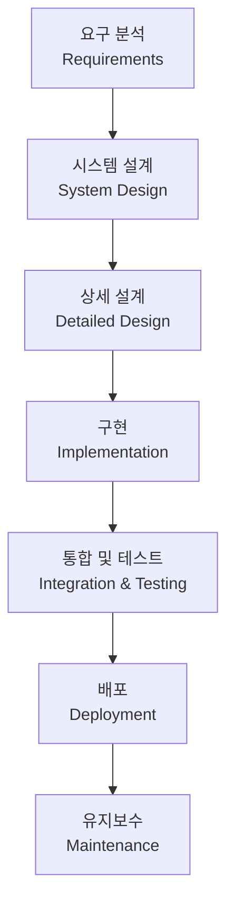

# 폭포수 모델 / Waterfall Model

각 단계를 순차적으로 완료한 후 다음 단계로 넘어가는 전통적인 소프트웨어 개발 방법론입니다.

A traditional sequential approach where each phase must be completed before the next begins.



## 특징

- **장점**: 명확한 단계 구분, 문서화 용이, 관리가 쉬움
- **단점**: 유연성 부족, 후반부 변경 비용 높음, 고객 피드백 반영 어려움

```math-anim
type: waterfall-model
params:
  currentPhase: { default: 3, min: 1, max: 7, step: 1, label: { kr: "현재 단계", en: "Current Phase" } }
  showCost: { default: true, label: { kr: "변경 비용", en: "Change Cost" } }
```

## 실생활 활용

- **군사/항공 시스템**
- **대규모 정부 프로젝트**
- **요구사항이 명확한 프로젝트**
